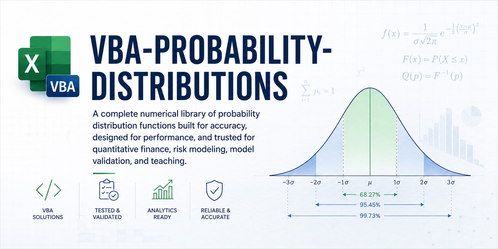
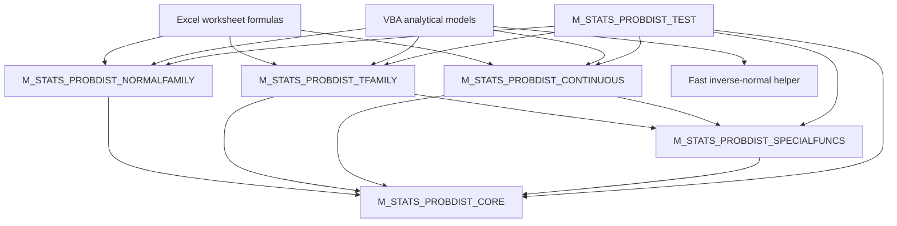

# VBA-PROBABILITY-DISTRIBUTIONS

<p align="center">
  <b>A robust, worksheet-friendly probability-distribution library written entirely in Excel VBA</b><br>
  Normal & Lognormal • Student t • Chi-square • F • Gamma • Beta • Exponential • Weibull • Uniform
</p>

<p align="center">
  
  
  
  
  
  
  
</p>

<p align="center">
  <b>📦 No add-in • No installer • No external DLL • No worksheet-function marshalling — import the VBA modules and use them directly.</b>
</p>

---

<p align="center">
  
</p>


---


> [!IMPORTANT]
> This repository is a numerical library, not a thin wrapper around `Application.WorksheetFunction`.
> Distribution calculations, special functions, validation, tail handling, overflow policy and diagnostics are implemented in native VBA.

---

## ✨ Overview

**VBA-PROBABILITY-DISTRIBUTIONS** provides a consistent set of probability-distribution functions for:

- 📊 Excel worksheet formulas
- 🧮 VBA analytical models
- 🎲 Monte Carlo engines
- 📈 financial-risk calculations
- 🎓 teaching and numerical demonstrations
- 🧪 regression-tested statistical tooling

The library exposes **58 worksheet-facing `K_STATS_*` functions** and a separate project-scoped numerical layer containing **26 reusable `PROB_*` helpers and special-function kernels**.

The public worksheet surface covers:

| Family | Distributions | Capabilities |
|---|---|---|
| Normal family | Standard Normal, Normal, Lognormal | Density, CDF, inverse CDF, interval probability, z-score, moments, parameter conversion |
| Classical test-statistic family | Student t, Chi-square, F | Density, CDF, survival, inverse CDF |
| Positive continuous family | Gamma, Exponential, Weibull | Density, CDF, survival, inverse CDF, selected moments |
| Bounded continuous family | Beta, Uniform | Density, CDF, survival, inverse CDF, selected moments |

---

## ⭐ Why this exists

Excel already includes many probability functions, but native worksheet functions are not always an ideal computational interface for VBA projects.

`Application.WorksheetFunction`:

- introduces per-call COM and worksheet-function marshalling overhead;
- raises runtime errors for invalid inputs rather than returning worksheet errors naturally;
- does not expose the reusable special-function kernels needed by a broader distribution library;
- encourages inconsistent validation and error handling across separate VBA procedures;
- can lose critical tail precision when callers compute `1 - CDF` instead of evaluating a survival function directly.

This repository provides a single VBA-native numerical stack with:

- 🧱 a shared elementary-numerics layer;
- 🧠 reusable incomplete-beta and incomplete-gamma kernels;
- 📐 consistent distribution parameterization;
- 🛡️ explicit domain, overflow and non-convergence handling;
- 🎯 direct evaluation of small tails;
- 🧾 optional diagnostic status messages;
- 🧪 one consolidated self-checking regression harness.

---

## 🚀 Key features

<p align="left">
  
  
  
  
  
  
</p>

### 📊 Consistent worksheet API

Worksheet-facing functions follow one naming convention:

```text
K_STATS_<Distribution>_<Operation>
```

Examples:

```excel
=K_STATS_Normal_Cumulative(1.96, 0, 1)
=K_STATS_StudentT_Survival(2.5, 10)
=K_STATS_Gamma_InverseCumulative(0.99, 3, 2)
=K_STATS_Beta_Density(0.4, 2, 5)
```

### 🎯 Direct survival functions

Small upper-tail probabilities are evaluated directly for Student t, Chi-square, F, Gamma, Beta, Exponential, Weibull and Uniform distributions.

This matters because:

```text
Survival(x) = 1 - CDF(x)
```

is mathematically correct but can be numerically wrong when `CDF(x)` rounds to exactly `1`.

### 🛡️ Explicit numerical contracts

- Invalid domains return `CVErr(xlErrNum)`.
- Predictable overflow and non-convergence return `CVErr(xlErrNum)`.
- Unexpected runtime errors return `CVErr(xlErrValue)`.
- Mathematically valid underflow returns zero.
- Public worksheet functions do not raise `MsgBox`.
- Detailed diagnostics can be returned through an optional `ByRef Status As String`.

### ⚡ Fast inverse-normal helper

`K_STATS_NormalStandard_InverseCumulativeFast` exposes the raw Acklam inverse-normal kernel for validated, high-volume numerical callers such as Monte Carlo engines.

It returns `Double`, avoids worksheet-facing `Variant` and `CVErr` overhead, and intentionally omits the final Halley refinement.

### 🧮 Stable elementary primitives

The shared core includes guarded arithmetic and cancellation-resistant primitives:

- `PROB_Log1p`
- `PROB_Expm1`
- `PROB_TryExp`
- `PROB_TryAdd`
- `PROB_TryMultiply`
- `PROB_TryDivide`

These protect tiny probabilities, extreme parameters and full-range finite `Double` inputs.

### 🧠 Reusable special functions

The project-scoped special-function module provides:

- log-gamma and log-beta;
- stable log-combination;
- regularized incomplete beta;
- inverse regularized incomplete beta;
- regularized incomplete gamma `P` and `Q`;
- inverse regularized incomplete gamma.

Iterative kernels return a Boolean success flag and never silently publish a non-converged partial result.

---

## 📦 Repository structure

```text
VBA-PROBABILITY-DISTRIBUTIONS/
├─ src/
│  ├─ M_STATS_PROBDIST_CORE.bas
│  ├─ M_STATS_PROBDIST_SPECIALFUNCS.bas
│  ├─ M_STATS_PROBDIST_NORMALFAMILY.bas
│  ├─ M_STATS_PROBDIST_TFAMILY.bas
│  ├─ M_STATS_PROBDIST_CONTINUOUS.bas
│  └─ M_STATS_PROBDIST_TEST.bas
├─ wiki/
│  ├─ Home.md
│  ├─ Getting-Started.md
│  ├─ Architecture.md
│  ├─ API-Reference.md
│  ├─ Normal-and-Lognormal-Family.md
│  ├─ StudentT-ChiSquare-and-F-Family.md
│  ├─ Continuous-Distributions.md
│  ├─ Special-Functions-and-Numerical-Kernels.md
│  ├─ Numerical-Accuracy-and-Design.md
│  ├─ Error-Handling-and-Diagnostics.md
│  ├─ Testing-and-Regression-Harness.md
│  ├─ Troubleshooting.md
│  └─ Coding-Style-and-Contributing.md
├─ README.md
└─ LICENSE
```

---

## 🏗️ Architecture



### Layer 1 — `M_STATS_PROBDIST_CORE`

Shared constants, domain predicates, guarded arithmetic, compensated elementary functions, raw inverse-normal kernel and diagnostic writer.

The module uses `Option Private Module`, so its public names remain visible across the VBA project but do not appear as worksheet functions.

### Layer 2 — `M_STATS_PROBDIST_SPECIALFUNCS`

Distribution-agnostic special-function kernels.

It also uses `Option Private Module` because these routines are internal numerical infrastructure rather than end-user worksheet functions.

### Layer 3 — Distribution families

- `M_STATS_PROBDIST_NORMALFAMILY`
- `M_STATS_PROBDIST_TFAMILY`
- `M_STATS_PROBDIST_CONTINUOUS`

These modules validate public inputs, call the shared kernels, translate predictable numerical failures into worksheet errors, and expose the `K_STATS_*` API.

### Layer 4 — `M_STATS_PROBDIST_TEST`

One consolidated test harness owns assertion helpers, counters, suite order, reference values, regression cases and the final pass/fail verdict.

See the [Architecture wiki page](wiki/Architecture.md) for the full dependency model.

---

## 🧩 Distribution catalogue

### Normal and Lognormal

| Distribution | Density | CDF | Survival | Inverse | Other |
|---|---:|---:|---:|---:|---|
| Standard Normal | ✅ | ✅ | — | ✅ | Interval probability, fast inverse |
| Normal | ✅ | ✅ | — | ✅ | Z-score, interval probability |
| Lognormal | ✅ | ✅ | — | ✅ | Mean, variance, standard deviation, parameter conversion |

### Student t, Chi-square and F

| Distribution | Density | CDF | Survival | Inverse |
|---|---:|---:|---:|---:|
| Student t | ✅ | ✅ | ✅ | ✅ |
| Chi-square | ✅ | ✅ | ✅ | ✅ |
| F | ✅ | ✅ | ✅ | ✅ |

### Other continuous distributions

| Distribution | Density | CDF | Survival | Inverse | Moments |
|---|---:|---:|---:|---:|---:|
| Gamma | ✅ | ✅ | ✅ | ✅ | Mean, variance, standard deviation |
| Beta | ✅ | ✅ | ✅ | ✅ | Mean, variance, standard deviation |
| Exponential | ✅ | ✅ | ✅ | ✅ | — |
| Weibull | ✅ | ✅ | ✅ | ✅ | Mean, variance, standard deviation |
| Uniform | ✅ | ✅ | ✅ | ✅ | — |

---

## 🛠️ Installation

### Option 1 — Import into an existing workbook

1. Open the target workbook.
2. Press `Alt + F11`.
3. In the VBA Editor, choose **File → Import File**.
4. Import all six modules:

```text
M_STATS_PROBDIST_CORE.bas
M_STATS_PROBDIST_SPECIALFUNCS.bas
M_STATS_PROBDIST_NORMALFAMILY.bas
M_STATS_PROBDIST_TFAMILY.bas
M_STATS_PROBDIST_CONTINUOUS.bas
M_STATS_PROBDIST_TEST.bas
```

5. Choose **Debug → Compile VBAProject**.
6. Save the workbook as `.xlsm` or `.xlsb`.
7. Run `Test_STATS_PROBDIST_RunAll`.

No references beyond the standard Excel/VBA environment are required.

### Option 2 — Import only the production library

The test module is not required at runtime. Production-only deployment may import the first five modules and omit:

```text
M_STATS_PROBDIST_TEST.bas
```

Keeping the test harness in development and release workbooks is strongly recommended.

---

## ⚡ Quick start

### Worksheet examples

```excel
=K_STATS_NormalStandard_Cumulative(1.64485362695147)
```

Returns approximately:

```text
0.95
```

```excel
=K_STATS_Normal_InverseCumulative(0.99, 100, 15)
```

Returns the 99th percentile of a normal distribution with mean `100` and standard deviation `15`.

```excel
=K_STATS_StudentT_Survival(3, 12)
```

Returns the direct upper-tail probability for a Student t variable.

```excel
=K_STATS_Weibull_InverseCumulative(0.9, 1.5, 100)
```

Returns the 90th percentile of a Weibull distribution with shape `1.5` and scale `100`.

### VBA examples

```vba
Option Explicit

Public Sub Example_NormalQuantile()

    Dim Status As String
    Dim Result As Variant

    Result = K_STATS_Normal_InverseCumulative(0.99, 100#, 15#, Status)

    If IsError(Result) Then
        Debug.Print "Calculation failed: " & Status
    Else
        Debug.Print "99th percentile: "; CDbl(Result)
    End If

End Sub
```

High-volume validated numerical loop:

```vba
Option Explicit

Public Sub Example_FastInverseNormal()

    Dim I As Long
    Dim P As Double
    Dim Z As Double

    For I = 1 To 100000
        P = (I - 0.5) / 100000#
        Z = K_STATS_NormalStandard_InverseCumulativeFast(P)
    Next I

End Sub
```

> [!CAUTION]
> The fast helper returns `Double` and is intended for already validated probabilities. Use the worksheet-facing inverse function when you require full validation, `CVErr` behavior and diagnostic status.

---

## 🧾 Parameterization

| Distribution | Parameters |
|---|---|
| Normal | Arithmetic mean and standard deviation |
| Lognormal | Mean and standard deviation of `Log(X)` |
| Student t | Positive real degrees of freedom |
| Chi-square | Positive real degrees of freedom |
| F | Positive real numerator and denominator degrees of freedom |
| Gamma | Shape and scale |
| Beta | Positive shape parameters `Alpha` and `Beta` |
| Exponential | Rate `Lambda`, not scale |
| Weibull | Shape and scale |
| Uniform | Finite lower and upper bounds with `LowerBound < UpperBound` |

Probabilities supplied to inverse functions use the open interval:

```text
0 < Probability < 1
```

---

## 🧯 Error policy

| Condition | Public result |
|---|---|
| Invalid parameter or probability domain | `#NUM!` |
| Predictable overflow | `#NUM!` |
| Density pole that is not representable as finite `Double` | `#NUM!` |
| Iterative kernel does not converge | `#NUM!` |
| Unexpected VBA runtime failure | `#VALUE!` |
| Mathematically valid exponential underflow | `0` |

Every worksheet-facing function accepts an optional final argument:

```vba
Optional ByRef Status As String = ""
```

Use it from VBA to retrieve a detailed failure explanation.

See [Error Handling and Diagnostics](wiki/Error-Handling-and-Diagnostics.md).

---

## 🎯 Numerical design highlights

- Hart/West standard-normal CDF approximation.
- Acklam inverse-normal approximation with Halley refinement for the validated public inverse.
- Kahan-style compensated `Log1p` and `Expm1`.
- Lanczos log-gamma with reflection.
- Modified Lentz continued fractions.
- Direct series evaluation for the lower incomplete-gamma region.
- Safeguarded Newton iteration with bisection fallback for inverse special functions.
- Paired complementary arguments to avoid reconstructing `1 - x` by cancellation.
- Direct survival-tail evaluation.
- Log-domain reconstruction for extreme F, Gamma, Exponential and Weibull calculations.
- Scaled and convex-combination formulas for Uniform calculations across the full finite `Double` range.

The implementation uses published numerical methods. The project contribution is their VBA packaging, validation, tail orientation, failure contracts, integration and regression coverage.

---

## ✅ Testing

Run the complete suite from the Immediate Window:

```vba
Test_STATS_PROBDIST_RunAll
```

Or run one family:

```vba
Test_STATS_PROBDIST_RunCore
Test_STATS_PROBDIST_RunNormalFamily
Test_STATS_PROBDIST_RunTFamily
Test_STATS_PROBDIST_RunContinuous
```

Passing assertions are silent. Failures print a detailed line, followed by a consolidated summary.

The test harness covers:

- known reference values;
- support and boundary behavior;
- symmetry and complement identities;
- inverse round-trips;
- extreme tails and quantiles;
- moment formulas;
- guarded overflow and valid underflow;
- diagnostic status behavior;
- exact `#NUM!` versus `#VALUE!` classification;
- named regression cases for previously vulnerable numerical paths.

See [Testing and Regression Harness](wiki/Testing-and-Regression-Harness.md).

---

## 📚 Wiki

| Page | Purpose |
|---|---|
| [Home](wiki/Home.md) | Documentation index and navigation |
| [Getting Started](wiki/Getting-Started.md) | Installation, first formulas and first VBA calls |
| [Architecture](wiki/Architecture.md) | Layering, dependencies and design boundaries |
| [API Reference](wiki/API-Reference.md) | Complete public function catalogue |
| [Normal and Lognormal Family](wiki/Normal-and-Lognormal-Family.md) | Formulas, parameterization and examples |
| [Student t, Chi-square and F](wiki/StudentT-ChiSquare-and-F-Family.md) | Test-statistic family and direct tails |
| [Continuous Distributions](wiki/Continuous-Distributions.md) | Gamma, Beta, Exponential, Weibull and Uniform |
| [Special Functions and Kernels](wiki/Special-Functions-and-Numerical-Kernels.md) | Internal beta/gamma architecture |
| [Numerical Accuracy and Design](wiki/Numerical-Accuracy-and-Design.md) | Stability techniques and algorithm provenance |
| [Error Handling and Diagnostics](wiki/Error-Handling-and-Diagnostics.md) | `CVErr`, status and failure contracts |
| [Testing and Regression Harness](wiki/Testing-and-Regression-Harness.md) | Test execution and regression registry |
| [Troubleshooting](wiki/Troubleshooting.md) | Common installation and runtime issues |
| [Coding Style and Contributing](wiki/Coding-Style-and-Contributing.md) | Repository conventions and contribution gates |

---

## 🔧 Coding style

The source follows a structured VBA house style:

- `Option Explicit`
- `Option Private Module` for internal project-scoped modules
- section banners
- structured procedure headers
- comments above related executable lines
- inline comments primarily for declarations
- explicit `Exit Function` / fail-safe paths
- no `MsgBox` from numerical UDFs
- clear separation between public validation wrappers and private numerical kernels
- predictable worksheet-error classification
- regression tests for numerical defect fixes

Typical procedure headers include:

```text
PURPOSE
WHY
INPUTS
RETURNS
BEHAVIOR
ERROR POLICY
DEPENDENCIES
NOTES
CALLED FROM
UPDATED
```

---

## 🧭 Roadmap

Potential future modules include:

- discrete distributions: Binomial, Poisson, Geometric and Negative Binomial;
- multivariate and bivariate distributions;
- random variate generation;
- additional interval-probability helpers;
- worksheet examples and demonstration workbook;
- automated source export and release validation;
- benchmark comparisons against high-precision references.

---

## 📄 License

MIT

---

## 👤 Author

<p align="left">
  
</p>
