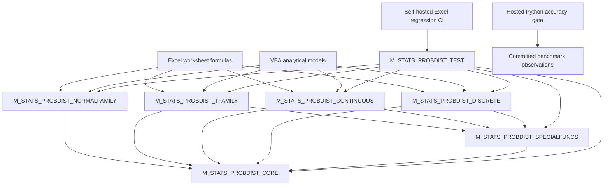

<div align="center">

# 📊 VBA Probability Distributions

### A transparent, tail-aware numerical probability library for pure Excel VBA

**Native special-function kernels · Stable probability algorithms · Direct survival functions · Safeguarded inverses · Continuous and discrete distributions · Regression and accuracy contracts**

<br>

[](https://github.com/danielep71/VBA-PROBABILITY-DISTRIBUTIONS)
[](https://github.com/danielep71/VBA-PROBABILITY-DISTRIBUTIONS)
[](#why-not-worksheetfunction)
[](#installation)
[](#direct-tail-design)
[](docs/EXCEL_VBA_CI.md)

<br>

[](LICENSE)
[](https://github.com/danielep71/VBA-PROBABILITY-DISTRIBUTIONS/stargazers)
[](https://github.com/danielep71/VBA-PROBABILITY-DISTRIBUTIONS/network/members)
[](https://github.com/danielep71/VBA-PROBABILITY-DISTRIBUTIONS/issues)
[](https://github.com/danielep71/VBA-PROBABILITY-DISTRIBUTIONS/commits/main)

<br>

**No add-in · No installer · No COM component · No external numerical runtime**

[API Reference](https://github.com/danielep71/VBA-PROBABILITY-DISTRIBUTIONS/wiki/API-Reference)
&nbsp;·&nbsp;
[Numerical Design](https://github.com/danielep71/VBA-PROBABILITY-DISTRIBUTIONS/wiki/Numerical-Accuracy-and-Design)
&nbsp;·&nbsp;
[Accuracy Summary](benchmark/accuracy_summary.md)
&nbsp;·&nbsp;
[Demo Workbook](examples/STATS-Distributions%20demo.xlsm)
&nbsp;·&nbsp;
[Wiki](https://github.com/danielep71/VBA-PROBABILITY-DISTRIBUTIONS/wiki)

</div>

---

<p align="center">
  
</p>

---

> [!IMPORTANT]
> **This is a numerical library, not a wrapper around `Application.WorksheetFunction`.**
>
> Distribution formulas, reusable special functions, direct tails, inverse solvers, validation, overflow and underflow handling, convergence policy, worksheet-error mapping, diagnostics, regression testing, and accuracy contracts are implemented as an inspectable VBA stack.

## What the project provides

**VBA Probability Distributions** is a self-contained univariate probability library for Microsoft Excel VBA. It exposes a consistent worksheet and VBA API for:

- probability densities and probability masses;
- natural-log probability masses for discrete distributions;
- cumulative distribution functions;
- direct survival functions;
- inverse cumulative functions;
- direct inverse-survival functions where implemented;
- stable interval probabilities;
- analytical moments;
- parameter conversion;
- reusable special-function kernels;
- explicit numerical diagnostics.

The library is intended for quantitative finance, banking and risk management, actuarial and reliability work, model validation, controlled spreadsheet models, numerical teaching, and independent reconciliation calculations.

> [!NOTE]
> The headline description is deliberately capability-based rather than tied to a fixed number of distributions or UDFs. The current source snapshot exposes **112 public worksheet-callable functions**, but the library is expected to evolve.

## Current release surface

| Area | Current implementation |
|---|---|
| Normal family | Standard Normal, Normal, Lognormal |
| Test-statistic family | Student t, Chi-square, F |
| Other continuous families | Gamma, Beta, Exponential, Weibull, continuous Uniform |
| Discrete families | Binomial, Poisson, Geometric, Negative Binomial, Hypergeometric, Discrete Uniform |
| Shared numerics | Guarded arithmetic, `Log1p`, `Expm1`, inverse-normal seed, gamma/beta kernels, combinatorial log kernels |
| Regression testing | Consolidated VBA harness with all production families |
| Excel automation | Self-hosted Windows/Excel GitHub Actions workflow |
| External accuracy | Regime-aware committed benchmark grid and strict Python gate |

At the documentation snapshot prepared on 2026-07-22, the generated accuracy summary contains **116 active contracts**, with **0 FAIL**, **0 KNOWN LIMITATION**, **0 CHARACTERIZATION ONLY**, and **0 PENDING**. Accuracy claims remain limited to their documented functions, regimes, points, metrics, and thresholds.

> [!CAUTION]
> The hosted Python accuracy gate checks the **committed observation grid**. It does not execute desktop Excel or regenerate VBA observations from the current source. Source changes affecting numerical behavior must be followed by a fresh Excel export before the benchmark evidence is treated as current.

---

# Distribution catalogue

## Normal and lognormal family

| Surface | Density | CDF | Survival | Inverse CDF | Inverse survival | Additional operations |
|---|:---:|:---:|:---:|:---:|:---:|---|
| Standard Normal | ✅ | ✅ | ✅ | ✅ | ✅ | Stable interval probability, fast inverse helper |
| Normal | ✅ | ✅ | ✅ | ✅ | ✅ | Z-score, stable interval probability |
| Lognormal | ✅ | ✅ | ✅ | ✅ | ✅ | Mean, variance, standard deviation, parameter conversion |

## Classical test-statistic family

| Distribution | Density | CDF | Survival | Inverse CDF |
|---|:---:|:---:|:---:|:---:|
| Student t | ✅ | ✅ | ✅ | ✅ |
| Chi-square | ✅ | ✅ | ✅ | ✅ |
| F | ✅ | ✅ | ✅ | ✅ |

## Other continuous distributions

| Distribution | Density | CDF | Survival | Inverse CDF | Moments |
|---|:---:|:---:|:---:|:---:|---|
| Gamma | ✅ | ✅ | ✅ | ✅ | Mean, variance, standard deviation |
| Beta | ✅ | ✅ | ✅ | ✅ | Mean, variance, standard deviation |
| Exponential | ✅ | ✅ | ✅ | ✅ | — |
| Weibull | ✅ | ✅ | ✅ | ✅ | Mean, variance, standard deviation |
| Continuous Uniform | ✅ | ✅ | ✅ | ✅ | — |

## Discrete distributions

| Distribution | PMF | LogPMF | CDF | Survival | Inverse CDF | Moments |
|---|:---:|:---:|:---:|:---:|:---:|---|
| Binomial | ✅ | ✅ | ✅ | ✅ | ✅ | Mean, variance, standard deviation |
| Poisson | ✅ | ✅ | ✅ | ✅ | ✅ | Mean, variance, standard deviation |
| Geometric | ✅ | ✅ | ✅ | ✅ | ✅ | Mean, variance, standard deviation |
| Negative Binomial | ✅ | ✅ | ✅ | ✅ | ✅ | Mean, variance, standard deviation |
| Hypergeometric | ✅ | ✅ | ✅ | ✅ | ✅ | Mean, variance, standard deviation |
| Discrete Uniform | ✅ | ✅ | ✅ | ✅ | ✅ | Mean, variance, standard deviation |

### Discrete parameterization

- **Binomial** — successes in `Trials`, with success probability `ProbSuccess`.
- **Poisson** — event count with intensity `Mean` (lambda).
- **Geometric** — failures before the first success; support starts at zero.
- **Negative Binomial** — failures before the `NumberSuccesses`-th success.
- **Hypergeometric** — successes in a sample drawn without replacement.
- **Discrete Uniform** — equal mass on every integer from `LowerBound` through `UpperBound`, inclusive.

---

<a id="installation"></a>

# Quick start

## 1. Import the production modules

Import the exported modules in this order:

```text
src/M_STATS_PROBDIST_CORE.bas
src/M_STATS_PROBDIST_SPECIALFUNCS.bas
src/M_STATS_PROBDIST_NORMALFAMILY.bas
src/M_STATS_PROBDIST_TFAMILY.bas
src/M_STATS_PROBDIST_CONTINUOUS.bas
src/M_STATS_PROBDIST_DISCRETE.bas
```

Then compile:

```text
VBA Editor → Debug → Compile VBAProject
```

Save the workbook as `.xlsm` or `.xlsb`.

## 2. Use the functions from a worksheet

### Standard Normal cumulative probability

```excel
=K_STATS_NormalStandard_Cumulative(1.64485362695147)
```

Returns approximately `0.95`.

### Direct Normal upper tail

```excel
=K_STATS_Normal_Survival(140,100,15)
```

Use the survival function directly when the desired result is a small right-tail probability.

### Gamma quantile

```excel
=K_STATS_Gamma_InverseCumulative(0.99,4,2.5)
```

The Gamma API uses **shape and scale**, not shape and rate.

### Binomial probability mass

```excel
=K_STATS_Binomial_PMF(7,10,0.6)
```

### Negative Binomial cumulative probability

```excel
=K_STATS_NegativeBinomial_Cumulative(5,3,0.4)
```

This models failures before the third success.

### Hypergeometric probability mass

```excel
=K_STATS_Hypergeometric_PMF(4,10,20,100)
```

### Discrete Uniform cumulative probability

```excel
=K_STATS_DiscreteUniform_Cumulative(2.8,-3,5)
```

The bounds are truncated toward zero, while the real-valued threshold uses the correct floor-based step behavior.

## 3. Call the API from VBA

```vba
Dim Result As Variant
Dim Status As String

Result = K_STATS_Beta_Survival(0.995, 2.5, 8#, Status)

If IsError(Result) Then
    Debug.Print Status
Else
    Debug.Print CDbl(Result)
End If
```

The optional `Status` argument is the detailed diagnostic channel. Worksheet callers normally consume the returned `Double` or `CVErr` directly.

## 4. Run the consolidated regression suite

Import:

```text
tests/M_STATS_PROBDIST_TEST.bas
```

Run:

```vba
Test_STATS_PROBDIST_RunAll
```

A successful run ends with:

```text
RESULT: ALL TESTS PASSED
```

Family-level entry points are also available:

```vba
Test_STATS_PROBDIST_RunCore
Test_STATS_PROBDIST_RunNormalFamily
Test_STATS_PROBDIST_RunTFamily
Test_STATS_PROBDIST_RunContinuous
Test_STATS_PROBDIST_RunDiscrete
```

---

# Numerical architecture



## Module inventory

| Module | Role | Public worksheet surface |
|---|---|---:|
| `M_STATS_PROBDIST_CORE` | Constants, predicates, guarded arithmetic, stable elementary functions, inverse-normal seed, diagnostics | Internal |
| `M_STATS_PROBDIST_SPECIALFUNCS` | Log-gamma, log-beta, Stirling error, log-combination, incomplete beta/gamma and inverses | Internal |
| `M_STATS_PROBDIST_NORMALFAMILY` | Standard Normal, Normal, Lognormal | 23 |
| `M_STATS_PROBDIST_TFAMILY` | Student t, Chi-square, F | 12 |
| `M_STATS_PROBDIST_CONTINUOUS` | Gamma, Beta, Exponential, Weibull, continuous Uniform | 29 |
| `M_STATS_PROBDIST_DISCRETE` | Six discrete families | 48 |
| `M_STATS_PROBDIST_TEST` | Consolidated deterministic regression harness | Test entry points |

`Option Private Module` keeps the `PROB_*` infrastructure project-visible but hidden from the worksheet Function Wizard.

## Dependency rule

Distribution modules may depend on `CORE` and `SPECIALFUNCS`. The core layers must not depend on distribution modules. The test harness may depend on every production module. This one-way dependency graph prevents circular numerical ownership and duplicate kernels.

---

# Numerical design

| Area | Numerical treatment |
|---|---|
| Standard Normal tails | Dedicated direct-tail evaluation |
| Standard Normal inverse | Acklam seed with guarded refinement |
| Small logarithmic increments | Compensated `PROB_Log1p` |
| Small exponential differences | Compensated `PROB_Expm1` |
| Gamma normalization | Lanczos-style log-gamma |
| Large Gamma ratios | Stable log-gamma differences |
| Beta normalization | Balanced and unbalanced log-beta paths |
| Incomplete beta | Paired complementary arguments and modified-Lentz continued fractions |
| Incomplete gamma | Lower series and upper continued fraction |
| Inverse beta/gamma | Safeguarded Newton iteration with bisection fallback |
| F arguments | Log-ratio logistic construction |
| Weibull moments | Log-domain reconstruction and cancellation control |
| Continuous Uniform | Scaled coordinates and convex-combination inverse |
| Binomial/Poisson mass | Loader-style Stirling-error/deviance arrangement |
| Binomial/Poisson tails | Direct incomplete-beta or incomplete-gamma identities |
| Negative Binomial | Loader log-mass plus direct incomplete-beta tails |
| Hypergeometric | Shared log-mass components plus near-tail ratio summation |
| Discrete Uniform | Closed forms, direct right tail, corrected integer quantile |
| Predictable arithmetic failure | Guarded `Try` routines and `#NUM!` classification |

<a id="direct-tail-design"></a>

## Direct-tail design

For a small upper-tail probability, this is numerically unsafe:

```text
1 - CDF(x)
```

Once `CDF(x)` rounds to `1`, the tail is lost. The library exposes direct survival functions and, for the Normal family, direct inverse-survival functions:

```excel
=K_STATS_NormalStandard_Survival(z)
=K_STATS_NormalStandard_InverseSurvival(q)
=K_STATS_Normal_Survival(x,mean,stddev)
=K_STATS_Lognormal_InverseSurvival(q,meanlog,stddevlog)
```

Use the tail-oriented API that matches the quantity being requested.

---

# Discrete numerical policy

## Count treatment

Except for the real-valued Discrete Uniform CDF/SF threshold, worksheet count inputs are:

1. validated as finite;
2. truncated toward zero;
3. checked against distribution-specific sign and ordering rules;
4. restricted to a domain in which integer progress and the numerical kernels remain reliable.

The largest consecutively representable integer in IEEE-754 `Double` is:

```text
2^53 - 1 = 9,007,199,254,740,991
```

## Supported domains

| Surface | Supported numerical domain |
|---|---|
| Binomial PMF and moments | `Trials <= 2^53 - 1` |
| Binomial CDF, SF, inverse | `Trials <= 10,000,000` |
| Poisson PMF | `NumberEvents` and `Mean <= 2^53 - 1` |
| Poisson CDF and SF | `NumberEvents <= 20,000,000`; `Mean <= 10,000,000` |
| Poisson inverse | `Mean <= 10,000,000`; searched quantile `<= 20,000,000` |
| Geometric counts and returned quantiles | `<= 2^53 - 1` |
| Negative Binomial PMF/LogPMF | `NumberFailures + NumberSuccesses <= 2^53 - 1` |
| Negative Binomial CDF, SF, inverse | failure count/quantile `<= 20,000,000`; `NumberSuccesses <= 10,000,000` |
| Hypergeometric | `PopulationSize <= 100,000,000`; cumulative ratio summation capped at `200,000` terms |
| Discrete Uniform | signed bounds within `±(2^53 - 1)`; inclusive support size `<= 2^53 - 1` |

These are implementation contracts, not mathematical restrictions on the underlying distributions.

---

# Public error contract

Worksheet-facing functions return `Variant` so they can return either a `Double` or a worksheet error.

| Condition | Public result | Meaning |
|---|---|---|
| Valid finite calculation | `Double` | Numerical result |
| Invalid mathematical domain | `#NUM!` | Parameters or probability are invalid |
| Unsupported implementation magnitude | `#NUM!` | Input exceeds the documented numerical domain |
| Predictable overflow | `#NUM!` | The mathematical result cannot be represented as finite `Double` |
| Density pole | `#NUM!` | The density diverges at the requested support boundary |
| Iterative non-convergence | `#NUM!` | A converged result was not established |
| Unexpected VBA runtime failure | `#VALUE!` | Unanticipated execution path |
| Valid exponential underflow | `0` | Correct floating-point limiting result |

Invalid inputs are not silently clipped or repaired. Public inverse cumulative functions normally require:

```text
0 < Probability < 1
```

No numerical UDF raises a `MsgBox`.

---

# Validation and assurance

## Deterministic VBA regression harness

The consolidated test module covers:

- independent reference values;
- exact constants and support boundaries;
- PMF/PDF identities;
- CDF/SF complements;
- direct-tail behavior;
- inverse minimality and round-trips;
- moment formulas;
- extreme and full-range cases;
- valid underflow and guarded overflow;
- exact `#NUM!` versus `#VALUE!` classification;
- diagnostic `Status` behavior;
- named regressions for historical numerical defects.

The current consolidated snapshot contains **743 assertions**, including **25 discrete-family test procedures** and dedicated coverage for every Discrete Uniform public function.

## Excel-driven CI

The self-hosted Excel runner:

- creates an isolated macro-enabled workbook;
- imports all six production modules and the consolidated test module;
- injects a machine-readable CI bridge;
- runs every suite, including `RunDiscreteSuite`;
- returns assertion totals to PowerShell;
- fails the workflow on any failed assertion or execution error;
- closes Excel and releases COM objects.

Desktop Excel is not available on GitHub-hosted runners, so this workflow requires a reviewed, activated, self-hosted Windows/Excel machine.

## External accuracy contracts

The benchmark pipeline separates:

1. high-precision reference generation;
2. Excel/VBA observation export;
3. Decimal-based error analysis and contract evaluation.

The strict hosted gate checks the committed grid and blocks on failed or unevaluated active contracts. The main grid currently includes external contracts for the existing continuous families and for Binomial, Poisson, Geometric, Negative Binomial, and Hypergeometric.

> [!NOTE]
> Discrete Uniform is covered by the VBA regression harness. Its addition to the independent external accuracy grid remains an assurance-roadmap item.

See:

- [`benchmark/README.md`](benchmark/README.md)
- [`benchmark/accuracy_contracts.csv`](benchmark/accuracy_contracts.csv)
- [`benchmark/accuracy_summary.md`](benchmark/accuracy_summary.md)
- [`benchmark/numerical_limitations.csv`](benchmark/numerical_limitations.csv)

---

# Repository structure

```text
VBA-PROBABILITY-DISTRIBUTIONS/
├─ .github/
│  └─ workflows/
│     ├─ accuracy-gate.yml
│     └─ excel-vba-regression.yml
├─ assets/
├─ benchmark/
│  ├─ accuracy_contracts.csv
│  ├─ accuracy_summary.md
│  ├─ compute_errors.py
│  ├─ M_STATS_PROBDIST_ACCURACYEXPORT.bas
│  ├─ numerical_limitations.csv
│  ├─ probability_accuracy_grid.csv
│  └─ dedicated numerical studies/
├─ ci/
│  └─ Run-ExcelVbaTests.ps1
├─ docs/
│  └─ EXCEL_VBA_CI.md
├─ examples/
│  └─ STATS-Distributions demo.xlsm
├─ src/
│  ├─ M_STATS_PROBDIST_CORE.bas
│  ├─ M_STATS_PROBDIST_SPECIALFUNCS.bas
│  ├─ M_STATS_PROBDIST_NORMALFAMILY.bas
│  ├─ M_STATS_PROBDIST_TFAMILY.bas
│  ├─ M_STATS_PROBDIST_CONTINUOUS.bas
│  └─ M_STATS_PROBDIST_DISCRETE.bas
├─ tests/
│  └─ M_STATS_PROBDIST_TEST.bas
├─ CONTRIBUTING.md
├─ LICENSE
├─ README.md
└─ SECURITY.md
```

---

# Documentation map

| Documentation | Purpose |
|---|---|
| [Wiki Home](https://github.com/danielep71/VBA-PROBABILITY-DISTRIBUTIONS/wiki) | Documentation index and current scope |
| [Getting Started](https://github.com/danielep71/VBA-PROBABILITY-DISTRIBUTIONS/wiki/Getting-Started) | Installation, compilation, and first formulas |
| [Architecture](https://github.com/danielep71/VBA-PROBABILITY-DISTRIBUTIONS/wiki/Architecture) | Layering, dependencies, and boundaries |
| [Module Reference](https://github.com/danielep71/VBA-PROBABILITY-DISTRIBUTIONS/wiki/Module-Reference) | Responsibilities of each source module |
| [API Reference](https://github.com/danielep71/VBA-PROBABILITY-DISTRIBUTIONS/wiki/API-Reference) | Complete worksheet-facing API |
| [Normal and Lognormal](https://github.com/danielep71/VBA-PROBABILITY-DISTRIBUTIONS/wiki/Normal-and-Lognormal-Family) | Gaussian-family behavior |
| [Student t, Chi-square, and F](https://github.com/danielep71/VBA-PROBABILITY-DISTRIBUTIONS/wiki/StudentT-ChiSquare-and-F-Family) | Test-statistic family |
| [Continuous Distributions](https://github.com/danielep71/VBA-PROBABILITY-DISTRIBUTIONS/wiki/Continuous-Distributions) | Gamma, Beta, Exponential, Weibull, Uniform |
| [Discrete Distributions](https://github.com/danielep71/VBA-PROBABILITY-DISTRIBUTIONS/wiki/Discrete-Distributions) | Six discrete families and supported domains |
| [Special Functions and Kernels](https://github.com/danielep71/VBA-PROBABILITY-DISTRIBUTIONS/wiki/Special-Functions-and-Numerical-Kernels) | Internal numerical infrastructure |
| [Numerical Accuracy and Design](https://github.com/danielep71/VBA-PROBABILITY-DISTRIBUTIONS/wiki/Numerical-Accuracy-and-Design) | Stability, domains, and accuracy interpretation |
| [Benchmarking and Accuracy Contracts](https://github.com/danielep71/VBA-PROBABILITY-DISTRIBUTIONS/wiki/Benchmarking-and-Accuracy-Contracts) | Benchmark workflow and evidence boundaries |
| [Repository Structure](https://github.com/danielep71/VBA-PROBABILITY-DISTRIBUTIONS/wiki/Repository-Structure) | Source, tests, CI, benchmark, and documentation layout |
| [Error Handling and Diagnostics](https://github.com/danielep71/VBA-PROBABILITY-DISTRIBUTIONS/wiki/Error-Handling-and-Diagnostics) | `CVErr` and `Status` contract |
| [Testing and Regression Harness](https://github.com/danielep71/VBA-PROBABILITY-DISTRIBUTIONS/wiki/Testing-and-Regression-Harness) | Suite structure and release checks |
| [Excel VBA CI](https://github.com/danielep71/VBA-PROBABILITY-DISTRIBUTIONS/wiki/Excel-VBA-CI) | Self-hosted Excel automation and security |
| [Troubleshooting](https://github.com/danielep71/VBA-PROBABILITY-DISTRIBUTIONS/wiki/Troubleshooting) | Common import, compilation, and numerical issues |

---

# Scope boundary

This repository is intentionally focused on **univariate probability distributions** and their supporting scalar numerical kernels.

It is not intended to contain:

- matrix and vector algebra;
- matrix decompositions;
- linear-system solvers;
- eigenvalue routines;
- covariance-matrix infrastructure;
- multivariate probability distributions.

Those capabilities belong in a separate future project using the `K_MAT_*` namespace. Keeping the projects independent preserves this repository's simple deployment model: import the probability `.bas` modules with no external project dependency.

The probability repository is also not a replacement for BLAS/LAPACK, SciPy, R, MATLAB, Boost.Math, or a compiled Monte Carlo engine.

---

# Roadmap

## Numerical assurance

- add Discrete Uniform to the independent external accuracy grid;
- expand regime-aware discrete validation;
- bind exported observations more explicitly to source revision and module hashes;
- maintain strict completeness checks for active benchmark contracts;
- publish reproducible performance measurements with recorded environments;
- add automated API/documentation consistency checks.

## Probability-library expansion

Directional future work includes:

- `M_STATS_RNG_CORE` for deterministic, reproducible random-number streams;
- `M_STATS_PROBDIST_RANDOM` for distribution-specific random variates;
- `M_STATS_PROBDIST_ARRAY` for range, array, and Excel 365 spill-oriented wrappers;
- additional direct-tail or interval functions where they provide material numerical value.

Random generation and array wrappers should remain separate from deterministic scalar distribution kernels.

## Separate linear-algebra project

A separate `K_MAT_*` project is the intended home for:

- vectors and matrices;
- products and transformations;
- decompositions;
- linear solvers;
- eigenvalue methods;
- condition diagnostics;
- any future multivariate probability layer that depends on matrix numerics.

The roadmap is directional rather than contractual. Numerical coherence, explicit domains, and regression evidence take priority over feature counts.

---

<a id="why-not-worksheetfunction"></a>

# Why not `WorksheetFunction`?

`Application.WorksheetFunction` is appropriate for many automation tasks. This project addresses a different requirement: a composable numerical stack inside VBA.

| Requirement | WorksheetFunction approach | Native library approach |
|---|---|---|
| Reuse incomplete-beta/gamma kernels | Not exposed | Available internally |
| Control tail orientation | Limited | Explicit |
| Classify non-convergence | Hidden | Explicit |
| Add project-specific diagnostics | Limited | Built in |
| Apply one validation policy | Caller-dependent | Centralized |
| Inspect and modify algorithms | No | Yes |
| Build higher-level numerical functions | Wrapper composition | Kernel composition |
| Teach numerical implementation | Black box | Inspectable |

The purpose is not to claim that Excel's native functions are unsuitable. It is to provide an independent, transparent, reusable VBA implementation for users who need that level of control.

---

# Contributing

Contributions are particularly useful when they provide:

- a reproducible numerical defect;
- an accuracy improvement with an independent reference;
- a direct-tail or interval formulation;
- an extreme-parameter regression case;
- a benchmark-contract extension;
- a documentation correction;
- a performance improvement that preserves numerical behavior.

Before opening a non-trivial pull request:

1. read [CONTRIBUTING.md](CONTRIBUTING.md);
2. state the mathematical parameterization;
3. document the supported numerical domain;
4. identify the numerical method and its provenance;
5. add or update VBA regression tests;
6. add or update external benchmark cases where applicable;
7. compile the full VBA project;
8. run `Test_STATS_PROBDIST_RunAll`;
9. re-export edited modules from the VBE;
10. update README and Wiki documentation.

---

# Release checklist

```text
[ ] Import the current production modules
[ ] Debug → Compile VBAProject
[ ] Run Test_STATS_PROBDIST_RunAll
[ ] Confirm RESULT: ALL TESTS PASSED
[ ] Run or review the Excel regression workflow
[ ] Regenerate affected VBA benchmark observations
[ ] Run the strict accuracy gate
[ ] Review PASS / FAIL / CHARACTERIZATION / PENDING states
[ ] Re-export changed .bas modules
[ ] Review the text diff
[ ] Update README and Wiki pages
[ ] Record the release tag or commit SHA
```

> [!IMPORTANT]
> A green regression result is necessary but not sufficient. Numerical changes should also be checked against an independent high-precision or professionally established reference.

---

# FAQ

<details>
<summary><strong>Does the library call Excel statistical worksheet functions internally?</strong></summary>

No. Distribution formulas and special-function kernels are implemented in VBA.

</details>

<details>
<summary><strong>Does it require an add-in or installer?</strong></summary>

No. Import the `.bas` files, compile the VBA project, and use the functions directly.

</details>

<details>
<summary><strong>Why do most public functions return Variant?</strong></summary>

A worksheet-facing function must be able to return either a valid `Double` or a worksheet error such as `#NUM!` or `#VALUE!`.

</details>

<details>
<summary><strong>Why is there an optional Status argument?</strong></summary>

`Status` gives VBA callers a detailed diagnostic without replacing the worksheet-safe return contract.

</details>

<details>
<summary><strong>Why are survival functions separate?</strong></summary>

Because subtracting a near-one CDF from one can destroy the small right-tail probability.

</details>

<details>
<summary><strong>How is the Geometric distribution parameterized?</strong></summary>

It counts failures before the first success and therefore has support `0, 1, 2, ...`.

</details>

<details>
<summary><strong>How is the Negative Binomial distribution parameterized?</strong></summary>

It counts failures before the `NumberSuccesses`-th success.

</details>

<details>
<summary><strong>How does Discrete Uniform handle non-integer X?</strong></summary>

PMF returns zero for a finite non-integer `X`. CDF and survival accept real thresholds and use floor-based step behavior.

</details>

<details>
<summary><strong>Are degrees of freedom restricted to integers?</strong></summary>

No. Student t, Chi-square, and F accept positive real degrees of freedom within their documented numerical domains.

</details>

<details>
<summary><strong>Does GitHub Actions execute Excel?</strong></summary>

The Excel workflow does, but only on a configured self-hosted Windows runner with desktop Excel. The hosted accuracy gate is pure Python and checks committed benchmark observations.

</details>

<details>
<summary><strong>Are multivariate distributions planned for this repository?</strong></summary>

No. Matrix numerics and multivariate distributions are intentionally reserved for a separate `K_MAT_*` project.

</details>

---

# Citation

```text
Penza, D. VBA Probability Distributions:
A native numerical probability-distribution library for Excel VBA.
GitHub repository:
https://github.com/danielep71/VBA-PROBABILITY-DISTRIBUTIONS
```

When reproducibility matters, cite the release tag or full commit SHA used.

---

# License

Released under the [MIT License](LICENSE).

Users remain responsible for independent validation in their intended application, especially in regulated, financial, actuarial, engineering, or safety-critical contexts.

---

<div align="center">

### Daniele Penza

[](https://github.com/danielep71)
[](https://github.com/danielep71/VBA-PROBABILITY-DISTRIBUTIONS)

<br>

**Built for transparent numerical work in the environment where millions of professional models already live: Excel.**

</div>
