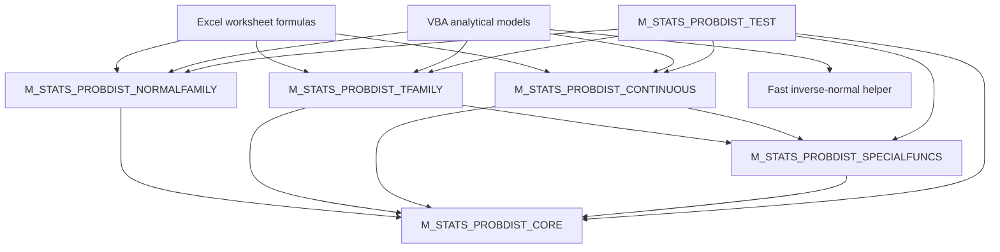

# VBA-PROBABILITY-DISTRIBUTIONS

<p align="center">
  <b>A self-contained, accurate numerical library for probability distributions, implemented entirely in Excel VBA</b><br>
  Complete native implementations for the supported distribution families — not a thin wrapper around worksheet functions
</p>

<p align="center">
  
  
  
  
  
  
  
</p>

<p align="center">
  <b>📦 No add-in • No installer • No external DLL • No worksheet-function marshalling</b>
</p>

---


---

> [!IMPORTANT]
> **This repository is a native numerical library, not a thin wrapper around `Application.WorksheetFunction`.**
>
> Distribution calculations, special functions, validation, direct tail evaluation, overflow and underflow handling, iterative convergence policy, worksheet-error mapping, and diagnostics are implemented in VBA.

## ✨ Overview

**VBA-PROBABILITY-DISTRIBUTIONS** provides a consistent statistical API for:

- 📊 Excel worksheet formulas
- 🧮 VBA analytical models
- 🎲 Monte Carlo engines
- 📈 finance and risk calculations
- 🎓 teaching and numerical demonstrations
- 🧪 model validation and regression testing

The library exposes:

- **61 worksheet-facing `K_STATS_*` functions**
- **26 project-scoped `PROB_*` routines and numerical kernels**
- **one consolidated self-checking regression harness**

The public surface covers ten distributions, with a dedicated Standard Normal convenience API.

| Family | Distributions | Capabilities |
|---|---|---|
| Normal family | Normal, Lognormal, Standard Normal API | Density, CDF, survival, inverse CDF, interval probability, z-score, moments, parameter conversion |
| Classical test-statistic family | Student t, Chi-square, F | Density, CDF, survival, inverse CDF |
| Positive continuous family | Gamma, Exponential, Weibull | Density, CDF, survival, inverse CDF, selected moments |
| Bounded continuous family | Beta, Uniform | Density, CDF, survival, inverse CDF, selected moments |

---

## ⭐ Why this exists

Excel includes many statistical worksheet functions, but `Application.WorksheetFunction` is not always an appropriate numerical foundation for a VBA project.

A worksheet-function wrapper:

- introduces worksheet-function marshalling on every call;
- raises VBA runtime errors for invalid inputs;
- does not expose reusable incomplete-beta and incomplete-gamma kernels;
- encourages inconsistent validation and failure handling;
- makes it easy to lose small upper-tail probabilities through `1 - CDF`;
- provides limited control over overflow, underflow, convergence, and diagnostics.

This repository instead provides:

- 🧱 shared elementary numerical primitives;
- 🧠 reusable special-function kernels;
- 📐 explicit and documented parameterization;
- 🎯 direct evaluation of small survival tails;
- 🛡️ guarded arithmetic and predictable error classification;
- 🧾 optional diagnostic status messages;
- 🧪 regression tests for values, boundaries, tails, inverses, and former defects.

---

## 🚀 Key features

<p align="left">
  
  
  
  
  
  
</p>

### 📊 Consistent worksheet API

Worksheet-facing functions follow one naming convention:

```text
K_STATS_<Distribution>_<Operation>
```

Examples:

```excel
=K_STATS_Normal_Cumulative(1.96, 0, 1)
=K_STATS_StudentT_Survival(2.5, 10)
=K_STATS_Gamma_InverseCumulative(0.99, 3, 2)
=K_STATS_Beta_Density(0.4, 2, 5)
```

### 🎯 Direct survival functions

Small upper tails are evaluated directly across the entire library — the Standard Normal API, Normal, Lognormal, Student t, Chi-square, F, Gamma, Beta, Exponential, Weibull, and Uniform.

Although mathematically:

```text
Survival(x) = 1 - CDF(x)
```

the subtraction can be numerically wrong when the CDF has rounded to exactly `1`.

### 🛡️ Explicit numerical contract

- Invalid domains return `CVErr(xlErrNum)`.
- Predictable overflow returns `CVErr(xlErrNum)`.
- Iterative non-convergence returns `CVErr(xlErrNum)`.
- Unexpected VBA runtime failures return `CVErr(xlErrValue)`.
- Mathematically valid exponential underflow returns `0`.
- Public UDFs do not display `MsgBox`.
- Detailed diagnostics are available through an optional `ByRef Status As String`.

### ⚡ Fast inverse-normal helper

`K_STATS_NormalStandard_InverseCumulativeFast` exposes the raw Acklam inverse-normal approximation for validated, high-volume VBA callers such as Monte Carlo engines.

It returns `Double`, avoids worksheet-facing `Variant` and `CVErr` overhead, and intentionally omits the final Halley refinement.

> [!CAUTION]
> Use the validated inverse when you require full domain checking, worksheet-error behavior, and diagnostic status.

### 🧮 Stable elementary primitives

The core layer includes:

```text
PROB_Log1p
PROB_Expm1
PROB_TryExp
PROB_TryAdd
PROB_TryMultiply
PROB_TryDivide
```

These routines protect tiny probabilities, moment calculations, extreme parameters, and full-range finite `Double` inputs.

### 🧠 Reusable special functions

The project-scoped numerical layer provides:

- log-gamma and log-beta;
- stable log-combination;
- regularized incomplete beta and its inverse;
- regularized incomplete gamma `P` and `Q`;
- inverse regularized incomplete gamma.

Iterative kernels return a Boolean success flag and never publish a non-converged partial result.

---

## 🧩 Distribution catalogue

### Normal family

| Distribution | Density | CDF | Survival | Inverse | Other |
|---|---:|---:|---:|---:|---|
| Standard Normal API | ✅ | ✅ | ✅ | ✅ | Interval probability, fast inverse |
| Normal | ✅ | ✅ | ✅ | ✅ | Z-score, interval probability |
| Lognormal | ✅ | ✅ | ✅ | ✅ | Mean, variance, standard deviation, parameter conversion |

### Classical test-statistic family

| Distribution | Density | CDF | Survival | Inverse |
|---|---:|---:|---:|---:|
| Student t | ✅ | ✅ | ✅ | ✅ |
| Chi-square | ✅ | ✅ | ✅ | ✅ |
| F | ✅ | ✅ | ✅ | ✅ |

### Other continuous distributions

| Distribution | Density | CDF | Survival | Inverse | Moments |
|---|---:|---:|---:|---:|---:|
| Gamma | ✅ | ✅ | ✅ | ✅ | Mean, variance, standard deviation |
| Beta | ✅ | ✅ | ✅ | ✅ | Mean, variance, standard deviation |
| Exponential | ✅ | ✅ | ✅ | ✅ | — |
| Weibull | ✅ | ✅ | ✅ | ✅ | Mean, variance, standard deviation |
| Uniform | ✅ | ✅ | ✅ | ✅ | — |

---

## 🧾 Parameterization at a glance

| Distribution | Parameters |
|---|---|
| Normal | Arithmetic mean and standard deviation |
| Lognormal | Mean and standard deviation of `Log(X)` |
| Student t | Positive real degrees of freedom |
| Chi-square | Positive real degrees of freedom |
| F | Positive real numerator and denominator degrees of freedom |
| Gamma | Shape and **scale** |
| Beta | Positive shape parameters `Alpha` and `Beta` |
| Exponential | **Rate** `Lambda`, not scale |
| Weibull | Shape and **scale** |
| Uniform | Finite lower and upper bounds with `LowerBound < UpperBound` |

> [!NOTE]
> Gamma and Weibull use a **scale** parameter, while Exponential uses a **rate** parameter. Shape parameters entering iterative kernels use a conservative supported-magnitude policy; evaluation points, scales, rates, and Uniform bounds use the full finite `Double` domain where mathematically meaningful.

Inverse functions require:

```text
0 < Probability < 1
```

Invalid values are not silently clipped or repaired.

---

## 🏗️ Architecture



| Layer | Module | Responsibility |
|---|---|---|
| 1 | `M_STATS_PROBDIST_CORE` | Constants, finiteness predicates, guarded arithmetic, `Log1p`, `Expm1`, raw inverse-normal seed, diagnostics |
| 2 | `M_STATS_PROBDIST_SPECIALFUNCS` | Log-gamma, log-beta, incomplete beta/gamma, continued fractions, series, safeguarded inverses |
| 3 | Distribution-family modules | Parameterization, support rules, validation, public UDFs, worksheet-error mapping |
| 4 | `M_STATS_PROBDIST_TEST` | Assertions, reference values, suite orchestration, regression registry, final verdict |

`CORE` and `SPECIALFUNCS` use `Option Private Module`: their `Public PROB_*` names are project-visible but hidden from the worksheet Function Wizard.

---

## 📦 Repository structure

```text
VBA-PROBABILITY-DISTRIBUTIONS/
├─ .github/
│  ├─ ISSUE_TEMPLATE/
│  └─ PULL_REQUEST_TEMPLATE.md
├─ assets/
│  ├─ Home.jpg
│  └─ social.png
├─ docs/
├─ examples/
├─ src/
│  ├─ M_STATS_PROBDIST_CORE.bas
│  ├─ M_STATS_PROBDIST_SPECIALFUNCS.bas
│  ├─ M_STATS_PROBDIST_NORMALFAMILY.bas
│  ├─ M_STATS_PROBDIST_TFAMILY.bas
│  └─ M_STATS_PROBDIST_CONTINUOUS.bas
├─ tests/
│  └─ M_STATS_PROBDIST_TEST.bas
├─ .gitignore
├─ CODE_OF_CONDUCT.md
├─ CONTRIBUTING.md
├─ LICENSE
├─ README.md
└─ SECURITY.md
```

The GitHub Wiki is maintained separately through:

```text
VBA-PROBABILITY-DISTRIBUTIONS.wiki.git
```

---

## 🛠️ Installation

### Production library

1. Open the target workbook.
2. Press `Alt + F11`.
3. Choose **File → Import File**.
4. Import:

```text
src/M_STATS_PROBDIST_CORE.bas
src/M_STATS_PROBDIST_SPECIALFUNCS.bas
src/M_STATS_PROBDIST_NORMALFAMILY.bas
src/M_STATS_PROBDIST_TFAMILY.bas
src/M_STATS_PROBDIST_CONTINUOUS.bas
```

5. Choose **Debug → Compile VBAProject**.
6. Save as `.xlsm` or `.xlsb`.

### Development and release validation

Also import:

```text
tests/M_STATS_PROBDIST_TEST.bas
```

Then run:

```vba
Test_STATS_PROBDIST_RunAll
```

No external DLL, add-in, COM component, or non-standard reference is required.

---

## ⚡ Quick start

### Worksheet formulas

```excel
=K_STATS_NormalStandard_Cumulative(1.64485362695147)
```

Returns approximately `0.95`.

```excel
=K_STATS_Normal_InverseCumulative(0.99, 100, 15)
```

Returns the 99th percentile of a normal distribution with mean `100` and standard deviation `15`.

```excel
=K_STATS_StudentT_Survival(3, 12)
```

Returns the direct upper-tail probability.

```excel
=K_STATS_Weibull_InverseCumulative(0.9, 1.5, 100)
```

Returns the 90th percentile of a Weibull distribution.

### VBA call with diagnostics

```vba
Option Explicit

Public Sub Example_NormalQuantile()

    Dim Status As String
    Dim Result As Variant

    Result = K_STATS_Normal_InverseCumulative(0.99, 100#, 15#, Status)

    If IsError(Result) Then
        Debug.Print "Calculation failed: " & Status
        Exit Sub
    End If

    Debug.Print "99th percentile: "; CDbl(Result)

End Sub
```

---

## 🧯 Error and diagnostics policy

| Condition | Public result |
|---|---|
| Invalid parameter or probability domain | `#NUM!` |
| Predictable arithmetic overflow | `#NUM!` |
| Non-representable density pole | `#NUM!` |
| Iterative non-convergence | `#NUM!` |
| Unexpected VBA runtime failure | `#VALUE!` |
| Mathematically valid exponential underflow | `0` |

Most worksheet-facing functions accept:

```vba
Optional ByRef Status As String = ""
```

Example:

```vba
Dim Status As String
Dim Result As Variant

Result = K_STATS_Gamma_Density(-1#, 2#, 3#, Status)

Debug.Print Result
Debug.Print Status
```

See [Error Handling and Diagnostics](https://github.com/danielep71/VBA-PROBABILITY-DISTRIBUTIONS/wiki/Error-Handling-and-Diagnostics).

---

## 🎯 Numerical design

The implementation uses established numerical methods, including:

- Hart/West Standard Normal CDF approximation;
- Acklam inverse-normal approximation;
- guarded Halley refinement;
- Kahan-style `Log1p` and `Expm1`;
- Lanczos log-gamma;
- stable log-beta and log-combination assembly;
- modified Lentz continued fractions;
- direct incomplete-gamma series and upper-tail continued fractions;
- safeguarded Newton iteration with bisection fallback;
- paired complementary beta arguments;
- direct survival-tail evaluation;
- log-domain reconstruction for extreme calculations;
- full-range Uniform scaling and convex-combination formulas.

The methods come from published numerical literature. The project contribution is their integration into a coherent VBA architecture with consistent validation, tail orientation, guarded arithmetic, failure contracts, diagnostics, and regression coverage.

---

## ✅ Testing

Run the complete suite from the Immediate Window:

```vba
Test_STATS_PROBDIST_RunAll
```

Or run one family:

```vba
Test_STATS_PROBDIST_RunCore
Test_STATS_PROBDIST_RunNormalFamily
Test_STATS_PROBDIST_RunTFamily
Test_STATS_PROBDIST_RunContinuous
```

Passing assertions are silent. Failures print a detailed line and the run closes with a consolidated summary.

The harness covers:

- known reference values;
- support and boundary behavior;
- symmetry and complement identities;
- inverse round-trips;
- extreme tails and quantiles;
- moment formulas;
- guarded overflow and valid underflow;
- diagnostic status;
- exact `#NUM!` versus `#VALUE!` classification;
- named regression cases.

> [!NOTE]
> Accept a release only after a clean VBE compilation and a green `Test_STATS_PROBDIST_RunAll` execution in Excel.

See [Testing and Regression Harness](https://github.com/danielep71/VBA-PROBABILITY-DISTRIBUTIONS/wiki/Testing-and-Regression-Harness).

---

## 📚 Documentation

| Page | Purpose |
|---|---|
| [Wiki Home](https://github.com/danielep71/VBA-PROBABILITY-DISTRIBUTIONS/wiki) | Documentation index |
| [Getting Started](https://github.com/danielep71/VBA-PROBABILITY-DISTRIBUTIONS/wiki/Getting-Started) | Installation and first calls |
| [Architecture](https://github.com/danielep71/VBA-PROBABILITY-DISTRIBUTIONS/wiki/Architecture) | Layering and dependency boundaries |
| [Module Reference](https://github.com/danielep71/VBA-PROBABILITY-DISTRIBUTIONS/wiki/Module-Reference) | Technical guide to all six modules |
| [API Reference](https://github.com/danielep71/VBA-PROBABILITY-DISTRIBUTIONS/wiki/API-Reference) | Complete callable surface |
| [Normal and Lognormal](https://github.com/danielep71/VBA-PROBABILITY-DISTRIBUTIONS/wiki/Normal-and-Lognormal-Family) | Gaussian-family behavior |
| [Student t, Chi-square, and F](https://github.com/danielep71/VBA-PROBABILITY-DISTRIBUTIONS/wiki/StudentT-ChiSquare-and-F-Family) | Classical test-statistic family |
| [Continuous Distributions](https://github.com/danielep71/VBA-PROBABILITY-DISTRIBUTIONS/wiki/Continuous-Distributions) | Gamma, Beta, Exponential, Weibull, Uniform |
| [Special Functions](https://github.com/danielep71/VBA-PROBABILITY-DISTRIBUTIONS/wiki/Special-Functions-and-Numerical-Kernels) | Beta/gamma numerical engine |
| [Numerical Accuracy and Design](https://github.com/danielep71/VBA-PROBABILITY-DISTRIBUTIONS/wiki/Numerical-Accuracy-and-Design) | Stability and provenance |
| [Troubleshooting](https://github.com/danielep71/VBA-PROBABILITY-DISTRIBUTIONS/wiki/Troubleshooting) | Common integration issues |

---

## 🔧 Coding style

The source follows a structured VBA house style:

- `Option Explicit`
- `Option Private Module` for internal numerical layers
- section banners
- structured procedure headers
- comments above related executable statements
- explicit success and failure paths
- no modal UI from numerical UDFs
- clear separation between wrappers and kernels
- regression tests for numerical fixes

Typical headers include relevant fields such as:

```text
PURPOSE
WHY
INPUTS
RETURNS
BEHAVIOR
ERROR POLICY
DEPENDENCIES
NOTES
CALLED FROM
UPDATED
```

See [CONTRIBUTING.md](CONTRIBUTING.md) for the full development and numerical-verification requirements.

---

## 🤝 Contributing

Contributions are welcome, particularly:

- reproducible numerical defects;
- accuracy improvements backed by independent references;
- new distributions or moments;
- additional tail or interval functions;
- regression tests;
- documentation corrections.

For non-trivial work, open an issue first.

Read:

- [Contributing Guide](CONTRIBUTING.md)
- [Code of Conduct](CODE_OF_CONDUCT.md)
- [Security Policy](SECURITY.md)

---

## 🧭 Roadmap

Potential future work includes:

- discrete distributions;
- additional interval probability functions;
- bivariate and multivariate distributions;
- random variate generation;
- an example workbook;
- reproducible external reference-generation scripts;
- automated static repository checks;
- benchmark grids for extreme parameters.

---

## 📄 License

Released under the [MIT License](LICENSE).

---

## 👤 Author

<p align="left">
  
</p>

Maintained by **Daniele Penza**.
