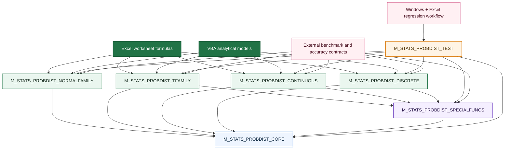

<div align="center">

# 📊 VBA Probability Distributions

### A transparent, tail-aware numerical probability library for pure Excel VBA

**Native special-function kernels · Stable probability algorithms · Direct survival functions · Safeguarded inverses · Discrete and continuous distributions · Regression and accuracy contracts**

<br>

[](https://github.com/danielep71/VBA-PROBABILITY-DISTRIBUTIONS)
[](https://github.com/danielep71/VBA-PROBABILITY-DISTRIBUTIONS)
[](#why-not-worksheetfunction)
[](#installation)
[](#why-direct-survival-functions-matter)
[](docs/EXCEL_VBA_CI.md)

<br>

[](LICENSE)
[](https://github.com/danielep71/VBA-PROBABILITY-DISTRIBUTIONS/stargazers)
[](https://github.com/danielep71/VBA-PROBABILITY-DISTRIBUTIONS/network/members)
[](https://github.com/danielep71/VBA-PROBABILITY-DISTRIBUTIONS/issues)
[](https://github.com/danielep71/VBA-PROBABILITY-DISTRIBUTIONS/commits/main)

<br>

**No add-in · No installer · No COM component · No external numerical runtime**

[Explore the API](https://github.com/danielep71/VBA-PROBABILITY-DISTRIBUTIONS/wiki/API-Reference)
&nbsp;·&nbsp;
[Review numerical design](https://github.com/danielep71/VBA-PROBABILITY-DISTRIBUTIONS/wiki/Numerical-Accuracy-and-Design)
&nbsp;·&nbsp;
[Inspect the accuracy summary](benchmark/accuracy_summary.md)
&nbsp;·&nbsp;
[Open the demo workbook](examples/STATS-Distributions%20demo.xlsm)
&nbsp;·&nbsp;
[View the Wiki](https://github.com/danielep71/VBA-PROBABILITY-DISTRIBUTIONS/wiki)

</div>

---

<p align="center">
  
</p>

---

> [!IMPORTANT]
> **This repository is a numerical library, not a thin wrapper around `Application.WorksheetFunction`.**
>
> Probability distributions, reusable special functions, direct tails, inverse solvers, validation, overflow and underflow handling, convergence policy, worksheet-error mapping, diagnostics, regression testing, and accuracy contracts are implemented as an inspectable numerical stack.

## ✨ What this project is

**VBA Probability Distributions** is a self-contained numerical probability library for Microsoft Excel VBA.

It provides a consistent worksheet and VBA API for:

- probability densities and probability masses;
- cumulative distribution functions;
- direct survival functions;
- inverse cumulative distributions;
- inverse survival functions where implemented;
- stable interval probabilities;
- transformations and parameter conversions;
- analytical moments;
- reusable special functions;
- explicit numerical diagnostics.

The library is designed for:

- 📈 quantitative finance and financial-risk models;
- 🏦 banking, treasury, capital-markets, actuarial, and model-validation work;
- 🧪 independent control calculations and reconciliation workbooks;
- 🎲 simulation utilities and inverse-transform workflows;
- 🎓 university teaching and numerical demonstrations;
- ⚙️ controlled Excel environments that require transparent algorithms and predictable error behavior.

> **Positioning**
>
> A production-oriented numerical probability library for pure Excel VBA, designed for numerical reliability within explicitly tested domains. It emphasizes transparency, tail accuracy, auditability, consistent contracts, and reproducible validation rather than attempting to reproduce the full breadth or compiled performance of SciPy, R, Boost.Math, MATLAB, or commercial numerical platforms.

> [!NOTE]
> The public surface is described by capability rather than by a fixed distribution or UDF count. The library is expected to evolve without making its headline description obsolete.

---

## 🚀 Recent developments

The project has moved beyond its original continuous-distribution scope.

| Development | Current state |
|---|---|
| **Discrete probability layer** | Binomial, Poisson, and Geometric PMF/CDF/SF/inverse/moments implemented |
| **Large-count mass stability** | Binomial and Poisson PMFs use Loader-style Stirling-error/deviance arrangements |
| **Explicit discrete domains** | Exact-integer and kernel-backed parameter limits are documented and enforced |
| **Tail-oriented discrete inverses** | Binomial and Poisson quantiles search using the numerically smaller tail |
| **Discrete regression suite** | Integrated into the consolidated VBA test harness |
| **Excel-driven CI** | Self-hosted Windows/Excel workflow and PowerShell/COM runner included |
| **External accuracy pipeline** | Regime-aware numerical contracts and generated accuracy summary committed |
| **Numerical provenance** | Algorithms, limits, failure policies, and validation evidence are documented separately |

The latest generated benchmark summary is available in [`benchmark/accuracy_summary.md`](benchmark/accuracy_summary.md). It distinguishes:

- ✅ **PASS** — the implementation meets the stated contract;
- ❌ **FAIL** — the measured error exceeds the contract;
- ⚠️ **KNOWN LIMITATION** — a documented numerical defect or boundary;
- 🧪 **CHARACTERIZATION ONLY** — measured behavior not currently used as a pass/fail claim;
- ⏳ **PENDING** — a contract not yet measured in the main grid.

> [!CAUTION]
> The external benchmark grid and the VBA regression harness are related but not identical. The discrete family is covered by the VBA regression suite; extension of the generated external accuracy grid to the complete discrete surface remains part of the assurance roadmap.

---

## 🌟 Why this repository is different

| Capability | Worksheet-function wrapper | Typical VBA helper collection | This project |
|---|:---:|:---:|:---:|
| Native distribution algorithms | — | Sometimes | ✅ |
| Reusable incomplete-beta and incomplete-gamma kernels | — | Rarely | ✅ |
| Direct upper-tail survival functions | Depends on Excel | Rarely | ✅ |
| Direct inverse-survival functions | Usually reconstructed as `INV(1-q)` | Rarely | ✅ |
| Safeguarded inverse solvers | Hidden | Rarely | ✅ |
| Cancellation-resistant `Log1p` / `Expm1` paths | Hidden | Rarely | ✅ |
| Loader-style discrete mass algorithms | Hidden | Rarely | ✅ |
| Explicit supported numerical domains | Hidden | Rarely | ✅ |
| Explicit overflow and non-convergence policy | — | Rarely | ✅ |
| Worksheet-safe `CVErr` results | Inconsistent from VBA | Varies | ✅ |
| Optional diagnostic status messages | — | Rarely | ✅ |
| Consolidated deterministic regression harness | — | Rarely | ✅ |
| Excel-driven regression workflow | — | Rarely | ✅ |
| Generated external accuracy contracts | — | Rarely | ✅ |
| No external numerical dependency | Excel runtime | Usually | ✅ |

This is not an attempt to replace general-purpose scientific-computing ecosystems. It is a focused effort to bring **transparent, reusable, numerically serious probability infrastructure** to native Excel VBA.

---

## 🧭 At a glance

<table>
<tr>
<td width="33%" valign="top">

### 🧠 Native numerical engine

Shared constants, stable elementary functions, special functions, continuous and discrete probability kernels, tail evaluators, and inverse solvers are implemented directly in VBA.

</td>
<td width="33%" valign="top">

### 🎯 Tail-aware calculations

Small upper-tail probabilities are evaluated directly rather than reconstructed as `1 - CDF`, avoiding catastrophic cancellation.

</td>
<td width="33%" valign="top">

### 🛡️ Explicit contracts

Invalid domains, unsupported magnitudes, predictable overflow, valid underflow, non-convergence, and unexpected runtime failures are classified deliberately.

</td>
</tr>
<tr>
<td width="33%" valign="top">

### 🧩 Consistent public API

Worksheet-facing functions use common naming, validation, diagnostics, return values, and documented parameterization.

</td>
<td width="33%" valign="top">

### 🧪 Evidence-led development

Known values, identities, tails, inverse round-trips, historical defects, and independent accuracy contracts are maintained as reusable test assets.

</td>
<td width="33%" valign="top">

### 📦 Frictionless deployment

Import standard `.bas` modules, compile the VBA project, and use the functions. No installer, add-in, DLL, or non-standard reference is required.

</td>
</tr>
</table>

---

# 🧩 Distribution catalogue

## Normal and lognormal family

| Distribution surface | Density | CDF | Survival | Inverse CDF | Inverse survival | Additional operations |
|---|:---:|:---:|:---:|:---:|:---:|---|
| Standard Normal API | ✅ | ✅ | ✅ | ✅ | ✅ | Stable interval probability, fast inverse helper |
| Normal | ✅ | ✅ | ✅ | ✅ | ✅ | Z-score, stable interval probability |
| Lognormal | ✅ | ✅ | ✅ | ✅ | ✅ | Mean, variance, standard deviation, parameter conversion |

## Classical test-statistic family

| Distribution | Density | CDF | Survival | Inverse CDF |
|---|:---:|:---:|:---:|:---:|
| Student t | ✅ | ✅ | ✅ | ✅ |
| Chi-square | ✅ | ✅ | ✅ | ✅ |
| F | ✅ | ✅ | ✅ | ✅ |

## Other continuous distributions

| Distribution | Density | CDF | Survival | Inverse CDF | Moments |
|---|:---:|:---:|:---:|:---:|:---:|
| Gamma | ✅ | ✅ | ✅ | ✅ | Mean, variance, standard deviation |
| Beta | ✅ | ✅ | ✅ | ✅ | Mean, variance, standard deviation |
| Exponential | ✅ | ✅ | ✅ | ✅ | — |
| Weibull | ✅ | ✅ | ✅ | ✅ | Mean, variance, standard deviation |
| Uniform | ✅ | ✅ | ✅ | ✅ | — |

## Discrete distributions

| Distribution | PMF | CDF | Survival | Inverse CDF | Moments |
|---|:---:|:---:|:---:|:---:|:---:|
| Binomial | ✅ | ✅ | ✅ | ✅ | Mean, variance, standard deviation |
| Poisson | ✅ | ✅ | ✅ | ✅ | Mean, variance, standard deviation |
| Geometric | ✅ | ✅ | ✅ | ✅ | Mean, variance, standard deviation |

### Discrete parameterization

- **Binomial** — `NumberSuccesses`, `Trials`, `ProbSuccess`.
- **Poisson** — `NumberEvents`, `Mean`, where `Mean` is the Poisson intensity \(\lambda\).
- **Geometric** — `NumberFailures`, `ProbSuccess`; the random variable counts failures before the first success and has support \(0,1,2,\ldots\).

The catalogue is intentionally described by **capability**, not by a fixed UDF count.

---

<a id="installation"></a>

# ⚡ Quick start

## 1. Import the production modules

Import the files in this order:

```text
src/M_STATS_PROBDIST_CORE.bas
src/M_STATS_PROBDIST_SPECIALFUNCS.bas
src/M_STATS_PROBDIST_NORMALFAMILY.bas
src/M_STATS_PROBDIST_TFAMILY.bas
src/M_STATS_PROBDIST_CONTINUOUS.bas
src/M_STATS_PROBDIST_DISCRETE.bas
```

Then choose:

```text
VBA Editor → Debug → Compile VBAProject
```

Save the workbook as `.xlsm` or `.xlsb`.

## 2. Use the functions from a worksheet

### Standard Normal cumulative probability

```excel
=K_STATS_NormalStandard_Cumulative(1.64485362695147)
```

Returns approximately `0.95`.

### General Normal quantile

```excel
=K_STATS_Normal_InverseCumulative(0.99,100,15)
```

Returns the 99th percentile of a Normal distribution with mean `100` and standard deviation `15`.

### Direct Normal upper-tail quantile

```excel
=K_STATS_NormalStandard_InverseSurvival(1E-18)
```

Returns the threshold associated with an upper-tail exceedance probability of `1E-18` without forming `1 - 1E-18`.

### Student t survival probability

```excel
=K_STATS_StudentT_Survival(3,12)
```

Returns the right-tail probability directly.

### Gamma quantile

```excel
=K_STATS_Gamma_InverseCumulative(0.99,3,2)
```

Returns the 99th percentile of a Gamma distribution with shape `3` and scale `2`.

### Binomial probability mass

```excel
=K_STATS_Binomial_PMF(7,20,0.35)
```

Returns \(P(X=7)\) for \(X\sim\mathrm{Binomial}(20,0.35)\).

### Binomial direct survival probability

```excel
=K_STATS_Binomial_Survival(14,20,0.35)
```

Returns \(P(X>14)\) directly.

### Poisson cumulative probability

```excel
=K_STATS_Poisson_Cumulative(12,8.5)
```

Returns \(P(X\le 12)\) for a Poisson variable with mean `8.5`.

### Poisson quantile

```excel
=K_STATS_Poisson_InverseCumulative(0.99,25)
```

Returns the smallest integer \(k\) such that \(P(X\le k)\ge 0.99\).

### Geometric probability

```excel
=K_STATS_Geometric_Cumulative(4,0.2)
```

Returns the probability of observing at most four failures before the first success.

## 3. Call the library from VBA

```vba
Option Explicit

Public Sub Example_PoissonQuantile()
'
'==============================================================================
' Example_PoissonQuantile
'------------------------------------------------------------------------------
' PURPOSE
'   Demonstrates a worksheet-facing probability-distribution call from VBA,
'   including explicit diagnostic handling.
'
' DEPENDENCIES
'   - K_STATS_Poisson_InverseCumulative
'==============================================================================
'
'------------------------------------------------------------------------------
' DECLARE
'------------------------------------------------------------------------------
    Dim Result              As Variant          'Calculated Poisson quantile
    Dim Status              As String           'Detailed diagnostic message

'------------------------------------------------------------------------------
' COMPUTE
'------------------------------------------------------------------------------
    'Calculate the 99th percentile of a Poisson distribution with mean 25
        Result = K_STATS_Poisson_InverseCumulative(0.99, 25#, Status)

'------------------------------------------------------------------------------
' HANDLE RESULT
'------------------------------------------------------------------------------
    'Report a controlled numerical failure
        If IsError(Result) Then
            Debug.Print "Calculation failed: " & Status
            Exit Sub
        End If

    'Report the valid integer-valued Double result
        Debug.Print "Poisson quantile: "; CDbl(Result)
End Sub
```

---

<a id="why-direct-survival-functions-matter"></a>

# 🎯 Why direct survival functions matter

Mathematically:

```text
Survival(x) = 1 - CDF(x)
```

Numerically, that subtraction may destroy the requested result when `CDF(x)` has already rounded to exactly `1`.

For example:

```vba
1# - K_STATS_StudentT_Cumulative(X, DegreesFreedom)
```

may return zero even when the true upper tail is still representable.

The library therefore exposes direct survival functions for the relevant continuous and discrete distributions:

```excel
=K_STATS_NormalStandard_Survival(Z)
=K_STATS_Normal_Survival(X,Mean,StdDev)
=K_STATS_Lognormal_Survival(X,MeanLog,StdDevLog)
=K_STATS_StudentT_Survival(X,DegreesFreedom)
=K_STATS_ChiSquare_Survival(X,DegreesFreedom)
=K_STATS_F_Survival(X,DegreesFreedom1,DegreesFreedom2)
=K_STATS_Gamma_Survival(X,Shape,Scale)
=K_STATS_Beta_Survival(X,Alpha,Beta)
=K_STATS_Exponential_Survival(X,Lambda)
=K_STATS_Weibull_Survival(X,Shape,Scale)
=K_STATS_Uniform_Survival(X,LowerBound,UpperBound)
=K_STATS_Binomial_Survival(K,Trials,ProbSuccess)
=K_STATS_Poisson_Survival(K,Mean)
=K_STATS_Geometric_Survival(K,ProbSuccess)
```

## Direct inverse survival

The same information-loss issue appears in reverse.

A small exceedance probability `q` is often converted to a threshold through:

```text
InverseCDF(1 - q)
```

When `q` is below machine resolution near one, `1 - q` rounds to exactly `1`, even though the required quantile remains finite.

The Normal family therefore exposes direct inverse-survival functions:

```excel
=K_STATS_NormalStandard_InverseSurvival(q)
=K_STATS_Normal_InverseSurvival(q,Mean,StdDev)
=K_STATS_Lognormal_InverseSurvival(q,MeanLog,StdDevLog)
```

> [!TIP]
> Use a direct survival function when the requested output is a small upper-tail probability. Use a direct inverse-survival function when the input itself is a small exceedance probability.

---

# 🏗️ Numerical architecture



## Layer 1 — Core numerical infrastructure

`M_STATS_PROBDIST_CORE` owns:

- correctly represented mathematical constants;
- finite-value and supported-magnitude predicates;
- guarded addition, multiplication, division, affine transforms, and exponentiation;
- cancellation-resistant `PROB_Log1p` and `PROB_Expm1`;
- the raw inverse-normal seed kernel;
- diagnostic status handling.

The internal module uses `Option Private Module`, keeping project-scoped `PROB_*` helpers available inside the VBA project while hiding them from the worksheet Function Wizard.

## Layer 2 — Special functions

`M_STATS_PROBDIST_SPECIALFUNCS` provides distribution-independent kernels:

- log-gamma;
- stable half-step log-gamma differences;
- log-beta;
- stable unbalanced-argument handling;
- log-combination support;
- Stirling error;
- regularized incomplete beta;
- inverse regularized incomplete beta;
- regularized incomplete gamma `P` and `Q`;
- inverse regularized incomplete gamma;
- series and continued-fraction evaluators with explicit convergence contracts.

## Layer 3 — Distribution families

The worksheet-facing modules are:

- `M_STATS_PROBDIST_NORMALFAMILY`
- `M_STATS_PROBDIST_TFAMILY`
- `M_STATS_PROBDIST_CONTINUOUS`
- `M_STATS_PROBDIST_DISCRETE`

They own parameterization, public validation, support-edge behavior, stable reconstruction, worksheet-error mapping, and the `K_STATS_*` API.

## Layer 4 — Regression harness

`M_STATS_PROBDIST_TEST` owns:

- suite orchestration;
- assertion helpers;
- independent reference values;
- complement and symmetry identities;
- inverse round-trips;
- regression cases;
- error-code verification;
- final green-or-red verdict.

## Layer 5 — Automated and external assurance

The repository contains two additional assurance channels:

1. **Excel regression automation** through a self-hosted Windows runner, desktop Excel, PowerShell, and COM.
2. **External accuracy contracts** generated from exported numerical results and summarized in `benchmark/accuracy_summary.md`.

These layers complement each other:

- VBA tests protect behavior, contracts, edge cases, and historical regressions.
- External benchmarks measure numerical error against independently generated references.
- CI makes the regression workflow repeatable when an appropriately configured runner is online.

---

# 🧠 Numerical design

The implementation uses established numerical ideas adapted carefully to VBA.

| Area | Numerical treatment |
|---|---|
| Standard Normal CDF | Rational approximation plus direct positive-tail evaluation |
| Standard Normal inverse | Acklam seed with guarded refinement |
| Small logarithmic increments | `PROB_Log1p` |
| Small exponential differences | `PROB_Expm1` |
| Gamma normalization | Lanczos-style log-gamma |
| Large-parameter Gamma ratios | Stable log-gamma difference paths |
| Beta normalization | Log-beta with balanced and unbalanced branches |
| Incomplete beta | Paired arguments and modified-Lentz continued fractions |
| Incomplete gamma | Lower series and upper continued fraction |
| Inverse beta/gamma | Safeguarded Newton iteration with bisection fallback |
| Student t tails | Closed forms where available; incomplete-beta transformation otherwise |
| F arguments | Log-ratio logistic pair without unsafe ratio formation |
| Weibull moments | Log-domain reconstruction and large-shape cancellation control |
| Uniform full-range bounds | Stable scaled coordinates and convex-combination inverse |
| Binomial PMF | Loader-style Stirling-error/deviance arrangement |
| Poisson PMF | Loader-style Stirling-error/deviance arrangement |
| Binomial CDF/SF | Direct regularized incomplete-beta identities |
| Poisson CDF/SF | Direct regularized incomplete-gamma identities |
| Binomial/Poisson inverse | Integer lower-bound search oriented to the smaller tail |
| Geometric CDF/SF | Guarded `Log1p` / `Expm1` closed forms |
| Predictable arithmetic failure | Guarded `Try` routines and `#NUM!` classification |

The algorithms are not presented as inventions of this repository. The contribution is their integration into a coherent, readable, reusable VBA architecture with consistent parameter validation, tail orientation, convergence behavior, diagnostics, and regression coverage.

---

# 🧮 Discrete numerical policy

Discrete distributions require an explicit integer and kernel-domain policy.

## Count treatment

Worksheet count arguments are:

1. validated as finite numbers;
2. required to be non-negative;
3. truncated toward zero;
4. restricted to a domain where integer progress and numerical kernels remain reliable.

The largest consecutively representable integer in IEEE-754 `Double` is:

```text
2^53 - 1 = 9,007,199,254,740,991
```

## Current supported domain

| Surface | Supported domain |
|---|---|
| Binomial PMF and moments | `Trials <= 2^53 - 1` |
| Binomial CDF, SF, inverse | `Trials <= 10,000,000` |
| Poisson PMF | `NumberEvents` and `Mean <= 2^53 - 1` |
| Poisson CDF and SF | `NumberEvents <= 20,000,000`; `Mean <= 10,000,000` |
| Poisson inverse | `Mean <= 10,000,000`; searched quantile capped at `20,000,000` |
| Geometric counts and returned quantiles | `<= 2^53 - 1` |

These are **implementation contracts**, not mathematical restrictions on the underlying distributions.

The tighter Binomial and Poisson CDF/SF/inverse limits align the public API with the practical iteration budgets of the current incomplete-beta and incomplete-gamma kernels. Inputs outside the documented range return `#NUM!` rather than entering an unbounded or misleading numerical path.

---

# 🛡️ Public numerical contract

Worksheet-facing functions return `Variant` so they can return either a `Double` or a worksheet error.

| Condition | Public result | Meaning |
|---|---|---|
| Valid finite calculation | `Double` | Numerical result |
| Invalid domain | `#NUM!` | Request lies outside the documented mathematical contract |
| Unsupported magnitude | `#NUM!` | Input exceeds the tested implementation domain |
| Predictable arithmetic overflow | `#NUM!` | Mathematical result is not representable as finite `Double` |
| Non-representable density pole | `#NUM!` | Density diverges at a support boundary |
| Iterative non-convergence | `#NUM!` | Kernel did not establish a converged result |
| Unexpected VBA runtime failure | `#VALUE!` | Unanticipated execution path |
| Mathematically valid exponential underflow | `0` | Correct floating-point limiting result |

Most worksheet-facing functions also support:

```vba
Optional ByRef Status As String = ""
```

Example:

```vba
Dim Result As Variant
Dim Status As String

Result = K_STATS_Binomial_Cumulative(12#, 20#, 0.35, Status)

If IsError(Result) Then
    Debug.Print Status
End If
```

> [!NOTE]
> The optional `Status` argument is primarily useful to VBA callers. Worksheet formulas normally consume the returned number or worksheet error directly.

---

# 📐 Parameterization

| Distribution | Convention | Important note |
|---|---|---|
| Normal | Mean and standard deviation | `StdDev > 0` |
| Lognormal | Mean and standard deviation of `Log(X)` | Not arithmetic mean and standard deviation |
| Student t | Positive real degrees of freedom | Not restricted to integers |
| Chi-square | Positive real degrees of freedom | Not restricted to integers |
| F | Positive real numerator and denominator degrees of freedom | Both strictly positive |
| Gamma | Shape and **scale** | Scale, not rate |
| Beta | Positive `Alpha` and `Beta` shapes | Support is `[0,1]` |
| Exponential | **Rate** `Lambda` | Rate, not scale |
| Weibull | Shape and **scale** | Both strictly positive |
| Uniform | Lower and upper bounds | `LowerBound < UpperBound` |
| Binomial | Trials and success probability | Counts truncated toward zero; inverse requires `0 < p < 1` |
| Poisson | Mean/intensity `Lambda` | `Mean >= 0` |
| Geometric | Failures before first success | `0 < p <= 1`; support starts at zero |

Unless a function documents otherwise, inverse cumulative functions require:

```text
0 < Probability < 1
```

Invalid probabilities and parameters are not silently clipped or repaired.

---

# ✅ Validation and numerical assurance

Trust in numerical software should come from visible evidence rather than broad adjectives.

This repository uses three complementary assurance mechanisms.

## 1. Deterministic VBA regression harness

Import:

```text
tests/M_STATS_PROBDIST_TEST.bas
```

Run the complete harness:

```vba
Test_STATS_PROBDIST_RunAll
```

Or run one layer independently:

```vba
Test_STATS_PROBDIST_RunCore
Test_STATS_PROBDIST_RunNormalFamily
Test_STATS_PROBDIST_RunTFamily
Test_STATS_PROBDIST_RunContinuous
Test_STATS_PROBDIST_RunDiscrete
```

The complete run executes suites in dependency order:

1. Core and reusable special functions
2. Normal and Lognormal family
3. Student t, Chi-square, and F family
4. Gamma, Beta, Exponential, Weibull, and Uniform family
5. Binomial, Poisson, and Geometric family

The suite covers:

- independently prepared reference values;
- exact constants and support boundaries;
- density and mass identities;
- CDF/SF complement identities;
- direct-tail accuracy;
- inverse-CDF minimality and round-trips;
- direct inverse-survival round-trips;
- cross-distribution identities;
- stable moments;
- full-range and extreme-parameter cases;
- valid underflow and guarded overflow;
- `#NUM!` versus `#VALUE!` classification;
- diagnostic status behavior;
- named regressions for previously identified defects.

A successful complete run reports:

```text
RESULT: ALL TESTS PASSED
```

## 2. Excel-driven regression workflow

The repository includes:

```text
.github/workflows/excel-vba-regression.yml
ci/Run-ExcelVbaTests.ps1
docs/EXCEL_VBA_CI.md
```

The workflow is designed for a self-hosted runner with:

```text
self-hosted
Windows
X64
excel
```

The PowerShell runner:

- creates an isolated temporary macro-enabled workbook;
- imports the current production and test modules;
- executes the regression suites through desktop Excel and COM;
- converts the VBA failure count into the process exit status;
- writes a machine-readable result log;
- closes Excel and releases COM resources.

> [!IMPORTANT]
> GitHub-hosted Windows runners do not include desktop Excel. The workflow therefore requires an installed, activated, and appropriately configured self-hosted Windows runner.

> [!CAUTION]
> Untrusted fork code should not execute directly on a privileged self-hosted Excel runner. The workflow documentation describes the repository's trust and review model.

## 3. External accuracy contracts

The benchmark layer separates:

- **reference generation**;
- **VBA result export**;
- **error computation**;
- **regime-aware thresholds**;
- **generated summary reporting**.

The live generated summary is:

```text
benchmark/accuracy_summary.md
```

The summary records, by numerical regime:

- measured quantity;
- metric;
- contract threshold;
- worst observed error;
- evaluated points;
- verdict.

It is generated by `compute_errors.py` and uses decimal evaluation from the exported high/low representation rather than silently reducing all comparisons to another binary `Double`.

> [!IMPORTANT]
> Never infer universal accuracy from a small table. Accuracy claims apply only to the documented functions, regimes, points, metrics, and thresholds. Consult the benchmark files and exact commit used.

---

# 📊 Interpreting accuracy results

A single “maximum error” number is usually misleading for probability software.

Different regions require different metrics:

| Region | Typical useful measure |
|---|---|
| Central probabilities | Absolute or relative output error |
| Small positive tails | Relative tail error |
| Near-one cumulative probabilities | Direct survival error rather than `1 - CDF` |
| Quantiles | Relative or absolute quantile error |
| Inverse validation | Reconstructed tail or CDF residual |
| Log-special functions | Absolute error in log space |
| Support boundaries | Exact behavior and error classification |

The project therefore uses **regime-aware contracts** rather than one tolerance for every input.

Examples of questions the benchmark framework is intended to answer:

- Does a direct survival function preserve a tail that subtraction from one erases?
- Does an inverse return an accurate quantile even when the reconstructed probability is extremely steep?
- Does a balanced Beta case require a different tolerance from a severely unbalanced case?
- Does a large-parameter PMF remain accurate near its mode?
- Is a result a failure, a documented limitation, or only a characterization study?

---

# 📦 Demo workbook

The repository includes a macro-enabled demonstration workbook:

[](examples/STATS-Distributions%20demo.xlsm)

The workbook is intended to provide:

- module-import guidance;
- compilation and validation steps;
- parameterization notes;
- public API reference tables;
- worksheet formulas;
- family-specific examples;
- comparisons with Excel and other numerical environments;
- links to source and documentation.

> [!CAUTION]
> Review source code before enabling macros. Use a reviewed repository version or tagged release and follow your organization's macro-security policy.

---

# 📁 Repository structure

The structure below reflects the inspected `main` branch at commit `e77d0a75f676439514c8ca5089b46160d144d6b3`.

```text
VBA-PROBABILITY-DISTRIBUTIONS/
├─ .gitattributes
├─ .github/
│  ├─ ISSUE_TEMPLATE/
│  │  ├─ bug_report.md
│  │  ├─ config.yml
│  │  └─ feature_request.md
│  ├─ workflows/
│  │  └─ excel-vba-regression.yml
│  └─ PULL_REQUEST_TEMPLATE.md
├─ .gitignore
├─ assets/
│  ├─ Home2.jpg
│  ├─ banner2.png
│  └─ social3.jpg
├─ benchmark/
│  ├─ beta_f_unbalanced/
│  │  ├─ __pycache__/
│  │  │  ├─ _ibeta.cpython-311.pyc
│  │  │  └─ _ibeta.cpython-313.pyc
│  │  ├─ M_STATS_PROBDIST_BETAF_INV.bas
│  │  ├─ M_STATS_PROBDIST_BETAF_UNBAL.bas
│  │  ├─ README.md
│  │  ├─ _ibeta.py
│  │  ├─ analyze_beta_f_inverse.py
│  │  ├─ analyze_beta_f_unbalanced.py
│  │  ├─ beta_f_inverse.bas
│  │  ├─ beta_f_inverse_grid.csv
│  │  ├─ beta_f_unbalanced.bas
│  │  ├─ beta_f_unbalanced_grid.csv
│  │  ├─ generate_beta_f_inverse.py
│  │  └─ generate_beta_f_unbalanced.py
│  ├─ delta_seam_study/
│  │  ├─ M_STATS_PROBDIST_DELTA_SEAM.bas
│  │  ├─ README.md
│  │  ├─ analyze_delta_seam.py
│  │  ├─ delta_seam.bas
│  │  ├─ delta_seam_grid.csv
│  │  └─ generate_delta_seam.py
│  ├─ f_envelope/
│  │  ├─ README.md
│  │  ├─ _ibeta.py
│  │  ├─ analyze_f_envelope.py
│  │  ├─ f_envelope.bas
│  │  ├─ f_envelope_bothlarge.bas
│  │  ├─ f_envelope_bothlarge_grid.csv
│  │  ├─ f_envelope_gap.bas
│  │  ├─ f_envelope_gap_grid.csv
│  │  ├─ f_envelope_grid.csv
│  │  ├─ generate_f_envelope.py
│  │  ├─ generate_f_envelope_bothlarge.py
│  │  └─ generate_f_envelope_gap.py
│  ├─ holdout/
│  │  ├─ M_STATS_PROBDIST_HOLDOUT.bas
│  │  ├─ README.md
│  │  ├─ _ibeta.py
│  │  ├─ analyze_holdout.py
│  │  ├─ generate_holdout.py
│  │  ├─ holdout.bas
│  │  └─ holdout_grid.csv
│  ├─ logbeta_study/
│  │  ├─ LogGammaDelta_design.md
│  │  ├─ M_STATS_PROBDIST_LOGBETA_STUDY.bas
│  │  ├─ README.md
│  │  ├─ analyze_logbeta_switch.py
│  │  ├─ generate_logbeta_switch.py
│  │  ├─ logbeta_study.bas
│  │  └─ logbeta_switch_grid.csv
│  ├─ M_STATS_PROBDIST_ACCURACYEXPORT.bas
│  ├─ README.md
│  ├─ accuracy_contracts.csv
│  ├─ accuracy_summary.md
│  ├─ compute_errors.py
│  ├─ environment.txt
│  ├─ generate_reference_values.py
│  ├─ numerical_limitations.csv
│  ├─ probability_accuracy_grid.csv
│  └─ render_contract_table.py
├─ ci/
│  └─ Run-ExcelVbaTests.ps1
├─ docs/
│  ├─ CODE_REVIEW_CHATGPT5.5_2026-07-19.md
│  ├─ CODE_REVIEW_FABLE5_2026-07-19.md
│  └─ EXCEL_VBA_CI.md
├─ examples/
│  ├─ .gitkeep
│  └─ STATS-Distributions demo.xlsm
├─ src/
│  ├─ M_STATS_PROBDIST_CONTINUOUS.bas
│  ├─ M_STATS_PROBDIST_CORE.bas
│  ├─ M_STATS_PROBDIST_DISCRETE.bas
│  ├─ M_STATS_PROBDIST_NORMALFAMILY.bas
│  ├─ M_STATS_PROBDIST_SPECIALFUNCS.bas
│  └─ M_STATS_PROBDIST_TFAMILY.bas
├─ tests/
│  └─ M_STATS_PROBDIST_TEST.bas
├─ CODE_OF_CONDUCT.md
├─ CONTRIBUTING.md
├─ LICENSE
├─ README.md
└─ SECURITY.md
```

The Wiki is maintained separately through the repository's Wiki interface. A documentation package aligned to this tree is available under the accompanying `wiki/` directory in this update bundle.

---

# 📚 Documentation map

| Documentation | Purpose |
|---|---|
| [Wiki Home](https://github.com/danielep71/VBA-PROBABILITY-DISTRIBUTIONS/wiki) | Documentation index |
| [Getting Started](https://github.com/danielep71/VBA-PROBABILITY-DISTRIBUTIONS/wiki/Getting-Started) | Installation and first calls |
| [Architecture](https://github.com/danielep71/VBA-PROBABILITY-DISTRIBUTIONS/wiki/Architecture) | Layers, boundaries, and dependencies |
| [Module Reference](https://github.com/danielep71/VBA-PROBABILITY-DISTRIBUTIONS/wiki/Module-Reference) | Technical guide to source modules |
| [API Reference](https://github.com/danielep71/VBA-PROBABILITY-DISTRIBUTIONS/wiki/API-Reference) | Worksheet-facing surface |
| [Normal and Lognormal](https://github.com/danielep71/VBA-PROBABILITY-DISTRIBUTIONS/wiki/Normal-and-Lognormal-Family) | Gaussian-family behavior |
| [Student t, Chi-square, and F](https://github.com/danielep71/VBA-PROBABILITY-DISTRIBUTIONS/wiki/StudentT-ChiSquare-and-F-Family) | Classical test-statistic family |
| [Continuous Distributions](https://github.com/danielep71/VBA-PROBABILITY-DISTRIBUTIONS/wiki/Continuous-Distributions) | Gamma, Beta, Exponential, Weibull, Uniform |
| [Discrete Distributions](https://github.com/danielep71/VBA-PROBABILITY-DISTRIBUTIONS/wiki/Discrete-Distributions) | Binomial, Poisson, and Geometric distributions and supported domains |
| [Special Functions and Kernels](https://github.com/danielep71/VBA-PROBABILITY-DISTRIBUTIONS/wiki/Special-Functions-and-Numerical-Kernels) | Internal beta/gamma, combinatorial, and elementary numerical engine |
| [Numerical Accuracy and Design](https://github.com/danielep71/VBA-PROBABILITY-DISTRIBUTIONS/wiki/Numerical-Accuracy-and-Design) | Algorithms, stability, supported domains, and provenance |
| [Benchmarking and Accuracy Contracts](https://github.com/danielep71/VBA-PROBABILITY-DISTRIBUTIONS/wiki/Benchmarking-and-Accuracy-Contracts) | Reproducible mpmath/VBA benchmark pipeline and dedicated numerical studies |
| [Repository Structure](https://github.com/danielep71/VBA-PROBABILITY-DISTRIBUTIONS/wiki/Repository-Structure) | Exact source, benchmark, CI, evidence, and documentation layout |
| [Error Handling and Diagnostics](https://github.com/danielep71/VBA-PROBABILITY-DISTRIBUTIONS/wiki/Error-Handling-and-Diagnostics) | Public failure contract |
| [Testing and Regression Harness](https://github.com/danielep71/VBA-PROBABILITY-DISTRIBUTIONS/wiki/Testing-and-Regression-Harness) | Test structure and release checks |
| [Excel VBA CI](https://github.com/danielep71/VBA-PROBABILITY-DISTRIBUTIONS/wiki/Excel-VBA-CI) | Self-hosted Windows/Excel regression workflow and security model |
| [Accuracy Summary](benchmark/accuracy_summary.md) | Generated regime-aware accuracy verdicts |
| [Troubleshooting](https://github.com/danielep71/VBA-PROBABILITY-DISTRIBUTIONS/wiki/Troubleshooting) | Common integration issues |

> [!NOTE]
> The Wiki should be updated alongside the README when a new module or public distribution family is released.

---

# 🔧 Source-code style

The source follows a deliberately structured VBA house style:

- `Option Explicit`;
- `Option Private Module` for internal numerical layers;
- section banners;
- structured procedure headers;
- comments above related executable statements;
- inline comments reserved primarily for declarations;
- explicit initialization, validation, compute, success, numeric-failure, and runtime-error sections;
- no modal UI from numerical UDFs;
- clear separation between public wrappers and reusable kernels;
- permanent regression tests for corrected numerical defects.

Procedure headers use relevant fields such as:

```text
PURPOSE
WHY
WORKSHEET EQUIVALENT
INPUTS
RETURNS
BEHAVIOR
NUMERICAL METHOD
ERROR POLICY
DEPENDENCIES
CALLED FROM
NOTES
UPDATED
```

Read [CONTRIBUTING.md](CONTRIBUTING.md) before submitting source changes.

---

<a id="why-not-worksheetfunction"></a>

# 🆚 Why not `WorksheetFunction`?

`Application.WorksheetFunction` is useful and appropriate for many automation tasks. This project addresses a different requirement: a **composable numerical library inside VBA**.

| Requirement | WorksheetFunction approach | Native library approach |
|---|---|---|
| Reuse incomplete-beta or incomplete-gamma kernels | Not exposed | Available internally |
| Control tail orientation | Limited | Explicit |
| Classify non-convergence | Hidden | Explicit |
| Add project-specific diagnostics | Limited | Built in |
| Maintain one validation policy | Caller-dependent | Centralized |
| Avoid worksheet-function marshalling | No | Yes |
| Inspect and modify algorithms | No | Yes |
| Create higher-level numerical functions | Wrapper composition | Kernel composition |
| Maintain independent validation logic | Difficult | Natural |
| Teach numerical implementation | Black box | Inspectable |

The purpose is not to claim that Excel's native functions are unsuitable. It is to provide an independent, transparent, reusable VBA numerical stack for users who need that level of control.

---

# 🎓 Example applications

<details>
<summary><strong>📉 Market and credit risk</strong></summary>

- Normal and Student t tail probabilities;
- quantile transformations for simulation;
- F and Chi-square diagnostics;
- Gamma and Beta priors or severity models;
- Binomial default-count models;
- Poisson event-frequency models;
- model-validation comparisons against Excel, Python, R, or vendor systems.

</details>

<details>
<summary><strong>🏦 Treasury and capital markets</strong></summary>

- Monte Carlo shocks through inverse distributions;
- tail-sensitive control calculations;
- reusable probability functions inside valuation or risk workbooks;
- transparent numerical components for governed spreadsheet models;
- independent UAT and reconciliation calculations.

</details>

<details>
<summary><strong>⚙️ Actuarial and reliability modelling</strong></summary>

- Weibull lifetime and failure-time models;
- Gamma severity and waiting-time models;
- Poisson event-frequency models;
- Geometric waiting-count models;
- Beta bounded-risk and probability models;
- Exponential reliability and survival calculations.

</details>

<details>
<summary><strong>🎓 Teaching and numerical demonstrations</strong></summary>

- compare stable and unstable formulations;
- inspect special-function transformations;
- demonstrate why direct survival functions matter;
- explore inverse-CDF methods and parameterization;
- compare continuous and discrete models;
- teach explicit numerical error contracts in an accessible language.

</details>

<details>
<summary><strong>🧪 Model validation and audit</strong></summary>

- independent calculation engines;
- documented parameter and support conventions;
- reproducible reference cases;
- explicit worksheet-error behavior;
- control totals and reconciliation workbooks;
- transparent investigation of tail discrepancies.

</details>

---

# 🔍 Scope and validation boundary

This project is designed to make numerical behavior inspectable and testable, but it is not an independently certified numerical package.

## Appropriate use cases

The library is particularly suited to:

- moderate-volume Excel calculations;
- teaching and methodological demonstrations;
- model-validation workpapers;
- transparent control implementations;
- environments where external runtimes cannot be installed;
- reusable numerical infrastructure inside VBA projects.

## It is not intended to replace

- high-performance compiled Monte Carlo engines;
- BLAS/LAPACK linear algebra;
- arbitrary-precision libraries;
- industrial optimization platforms;
- complete statistical ecosystems;
- independently certified regulatory or safety-critical software.

## Current boundaries

- floating-point behavior remains subject to IEEE-754 `Double`;
- every accuracy claim is limited to the documented numerical regime;
- external benchmark coverage is broader for some families than others;
- a self-hosted Excel runner must be online and correctly configured for CI execution;
- users remain responsible for independent validation in their intended application;
- the exact release tag or commit SHA should be recorded whenever reproducibility matters.

This explicit boundary is a feature. Numerical software is trustworthy when its assumptions, limits, and verification process are visible.

---

# 🧭 Roadmap

## Numerical assurance

- extend the generated external accuracy grid to the complete discrete surface;
- add larger regime-aware Binomial and Poisson validation grids;
- add direct comparison artifacts against Boost.Math, SciPy, R, or high-precision references;
- publish repeatable performance benchmarks with recorded environments;
- add API/documentation consistency checks;
- strengthen automated exported-module static checks;
- maintain machine-readable accuracy and regression artifacts.

## Discrete distributions

Potential future additions include:

- Negative Binomial;
- Hypergeometric;
- Discrete Uniform;
- additional interval-probability helpers;
- direct inverse-survival functions where they provide material numerical value.

## Wider library expansion

Potential future work includes:

- bivariate and multivariate distributions;
- random variate generation;
- parameter estimation;
- goodness-of-fit utilities;
- reusable numerical-testing infrastructure;
- compiled acceleration paths while preserving the pure-VBA reference implementation.

The roadmap is directional rather than contractual. Numerical coherence and regression coverage take priority over headline feature counts.

---

# 🤝 Contributing

Contributions are welcome, particularly:

- reproducible numerical defects;
- accuracy improvements supported by independent references;
- new distributions and moments;
- direct-tail or interval functions;
- extreme-parameter regression cases;
- benchmark-contract extensions;
- documentation corrections;
- performance improvements that preserve numerical behavior.

Before opening a non-trivial pull request:

1. read [CONTRIBUTING.md](CONTRIBUTING.md);
2. open an issue to discuss scope;
3. state the numerical method and independent reference;
4. document the supported domain;
5. add or update regression tests;
6. add or update external benchmark cases where applicable;
7. compile the VBA project;
8. run the complete test harness;
9. re-export edited modules from the VBE;
10. update the affected Wiki pages and README sections.

Also read:

- [Code of Conduct](CODE_OF_CONDUCT.md)
- [Security Policy](SECURITY.md)

---

# ✅ Release checklist

A release candidate should satisfy all applicable items:

```text
[ ] Import the current production modules
[ ] Debug → Compile VBAProject
[ ] Run Test_STATS_PROBDIST_RunAll
[ ] Confirm RESULT: ALL TESTS PASSED
[ ] Run or review the Excel CI workflow
[ ] Regenerate affected benchmark exports
[ ] Regenerate benchmark/accuracy_summary.md
[ ] Review PASS / FAIL / CHARACTERIZATION / PENDING states
[ ] Re-export changed .bas modules
[ ] Review the text diff
[ ] Update README and Wiki documentation
[ ] Record the release tag or commit SHA
```

> [!IMPORTANT]
> A green regression result is necessary but not sufficient. Numerical changes should also be checked against an independent high-precision or professionally established reference.

---

# ❓ FAQ

<details>
<summary><strong>Does this library call Excel's statistical worksheet functions internally?</strong></summary>

No. The distribution algorithms and special-function kernels are implemented in VBA.

</details>

<details>
<summary><strong>Does it require an add-in or installer?</strong></summary>

No. Import the `.bas` modules into a workbook or VBA project, compile, and use them directly.

</details>

<details>
<summary><strong>Does it work in 64-bit Office?</strong></summary>

Yes. The numerical modules do not depend on 32-bit-only API declarations.

</details>

<details>
<summary><strong>Why do public functions return Variant?</strong></summary>

Worksheet-facing functions return `Variant` so they can return either a valid `Double` or a worksheet error such as `#NUM!` or `#VALUE!`.

</details>

<details>
<summary><strong>Why is there an optional Status argument?</strong></summary>

The `Status` argument allows VBA callers to receive a detailed diagnostic message while the worksheet-facing return value remains a standard number or `CVErr`.

</details>

<details>
<summary><strong>Why are upper tails exposed as separate functions?</strong></summary>

Because `1 - CDF` can lose every significant digit when the CDF rounds to one. A direct survival function preserves the small upper tail.

</details>

<details>
<summary><strong>Why does the Normal family expose inverse survival?</strong></summary>

Because `InverseCDF(1 - q)` fails when a very small `q` is lost in subtraction from one. The inverse-survival functions invert the upper-tail probability directly.

</details>

<details>
<summary><strong>How is the Geometric distribution parameterized?</strong></summary>

It counts failures before the first success. Its support starts at zero and its mass is:

```text
P(X = k) = p(1-p)^k
```

</details>

<details>
<summary><strong>Why are there explicit limits for large Binomial and Poisson inputs?</strong></summary>

A mathematically valid parameter is not automatically within the reliable operating range of a particular incomplete-beta or incomplete-gamma implementation. Explicit limits prevent non-progress, misleading non-convergence, and unsupported accuracy claims.

</details>

<details>
<summary><strong>Why not store discrete counts as Long?</strong></summary>

VBA `Long` is limited to approximately 2.1 billion. Worksheet functions accept numeric cells as `Double`, and some discrete PMF and moment calculations can safely support larger exact integers. The module therefore uses `Double` with an explicit exact-integer policy and tighter kernel-specific limits.

</details>

<details>
<summary><strong>Does GitHub Actions run Excel automatically?</strong></summary>

The repository includes a workflow and PowerShell runner, but actual execution requires an online self-hosted Windows machine with desktop Excel installed, activated, and configured.

</details>

<details>
<summary><strong>Are the benchmark results universal error guarantees?</strong></summary>

No. They are measured contracts for documented functions, regimes, points, metrics, and thresholds. Always inspect the benchmark artifacts and exact commit used.

</details>

<details>
<summary><strong>Are degrees of freedom restricted to integers?</strong></summary>

No. Student t, Chi-square, and F degrees of freedom are accepted as positive real values within the documented numerical domain.

</details>

<details>
<summary><strong>Is this a replacement for SciPy, R, MATLAB, or Boost.Math?</strong></summary>

No. Those ecosystems offer much broader functionality, compiled performance, and extensive independent validation. This repository provides a focused native-VBA probability engine for Excel-based applications.

</details>

---

# 📜 Citation

For teaching material, research notes, model documentation, or internal methodology references, a suggested citation is:

```text
Penza, D. VBA Probability Distributions:
A native numerical probability-distribution library for Excel VBA.
GitHub repository:
https://github.com/danielep71/VBA-PROBABILITY-DISTRIBUTIONS
```

When reproducibility matters, cite the release tag or full commit SHA used.

---

# 📄 License

Released under the [MIT License](LICENSE).

You may use, modify, and distribute the software subject to the terms of the license. Numerical software should always be independently validated for its intended use, especially in regulated, financial, actuarial, engineering, or safety-critical contexts.

---

# 👤 Maintainer

<div align="center">

### Daniele Penza

[](https://github.com/danielep71)
[](https://github.com/danielep71/VBA-PROBABILITY-DISTRIBUTIONS)

<br>

**Built for transparent numerical work in the environment where millions of professional models already live: Excel.**

<br>

If this project is useful, consider starring the repository, opening a discussion, reporting a reproducible numerical case, or contributing an independently validated improvement.

</div>
