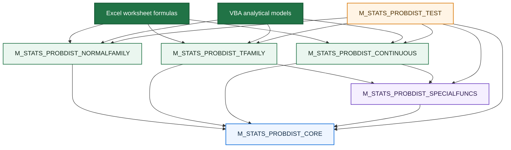

<div align="center">

# 📊 VBA Probability Distributions

### Professional-grade numerical probability distributions for pure Excel VBA

**Native special-function kernels · Stable tail algorithms · Direct survival and inverse-survival functions · Safeguarded inverses · Regression-tested numerical contracts**

<br>

[](https://github.com/danielep71/VBA-PROBABILITY-DISTRIBUTIONS)
[](https://github.com/danielep71/VBA-PROBABILITY-DISTRIBUTIONS)
[](#why-not-worksheetfunction)
[](#installation)
[](#why-direct-survival-and-inverse-survival-functions-matter)

<br>

[](LICENSE)
[](https://github.com/danielep71/VBA-PROBABILITY-DISTRIBUTIONS/stargazers)
[](https://github.com/danielep71/VBA-PROBABILITY-DISTRIBUTIONS/network/members)
[](https://github.com/danielep71/VBA-PROBABILITY-DISTRIBUTIONS/issues)
[](https://github.com/danielep71/VBA-PROBABILITY-DISTRIBUTIONS/commits/main)

<br>

**No add-in · No installer · No COM component · No external numerical runtime**

[Explore the API](https://github.com/danielep71/VBA-PROBABILITY-DISTRIBUTIONS/wiki/API-Reference)
&nbsp;·&nbsp;
[Read the numerical design](https://github.com/danielep71/VBA-PROBABILITY-DISTRIBUTIONS/wiki/Numerical-Accuracy-and-Design)
&nbsp;·&nbsp;
[Open the demo workbook](examples/Probability_Distributions_Demo.xlsm)
&nbsp;·&nbsp;
[View the Wiki](https://github.com/danielep71/VBA-PROBABILITY-DISTRIBUTIONS/wiki)

</div>

---

<p align="center">
  
</p>

---

> [!IMPORTANT]
> **This repository is a numerical library—not a thin wrapper around `Application.WorksheetFunction`.**
>
> Probability distributions, reusable special functions, tail evaluation, inverse solvers, validation, overflow and underflow handling, convergence policy, worksheet-error mapping, and diagnostics are implemented directly in native VBA.

## ✨ What this project is

**VBA Probability Distributions** is a self-contained numerical probability library for Excel VBA.

It provides a consistent worksheet and VBA API for probability densities, cumulative distributions, direct survival functions, quantiles, interval probabilities, transformations, and statistical moments. The public distribution functions are built on project-scoped numerical infrastructure rather than delegated to Excel worksheet functions.

The project is designed for:

- 📈 quantitative finance and financial-risk models;
- 🏦 banking, treasury, capital-markets, and model-validation work;
- 🎲 Monte Carlo engines and simulation utilities;
- ⚙️ actuarial and reliability calculations;
- 🎓 university teaching and numerical demonstrations;
- 🧪 controlled VBA environments that require transparent algorithms and explicit error behavior.

> **Positioning**
>
> A professional-grade numerical probability distribution library for pure Excel VBA, implementing its own special-function kernels, cancellation-resistant algorithms, direct survival and inverse-survival functions, guarded arithmetic, and automated regression tests—without relying on Excel's `WorksheetFunction` API.

> [!NOTE]
> The public surface is described by capability rather than by a fixed distribution or UDF count. The library is expected to evolve without making the repository's headline positioning obsolete.

---

## 🌟 Why this repository is different

| Capability | Worksheet-function wrapper | Typical VBA helper collection | This project |
|---|:---:|:---:|:---:|
| Native distribution algorithms | — | Sometimes | ✅ |
| Reusable incomplete-beta and incomplete-gamma kernels | — | Rarely | ✅ |
| Direct upper-tail survival functions | Depends on Excel | Rarely | ✅ |
| Direct inverse-survival functions | Usually reconstructed as `INV(1-q)` | Rarely | ✅ |
| Safeguarded inverse solvers | Hidden | Rarely | ✅ |
| Cancellation-resistant `Log1p` / `Expm1` paths | Hidden | Rarely | ✅ |
| Explicit overflow and non-convergence policy | — | Rarely | ✅ |
| Worksheet-safe `CVErr` results | Inconsistent from VBA | Varies | ✅ |
| Optional diagnostic status messages | — | Rarely | ✅ |
| Consolidated numerical regression harness | — | Rarely | ✅ |
| No external numerical dependency | Excel runtime | Usually | ✅ |

This is not an attempt to reproduce every feature of R, SciPy, Boost.Math, or a commercial statistics platform. It is a focused effort to bring **transparent, reusable, high-quality numerical probability infrastructure** to native Excel VBA.

---

## 🧭 At a glance

<table>
<tr>
<td width="33%" valign="top">

### 🧠 Native numerical engine

The library implements shared constants, stable elementary functions, special functions, distribution kernels, direct-tail evaluators, and inverse solvers directly in VBA.

</td>
<td width="33%" valign="top">

### 🎯 Tail-aware calculations

Small upper-tail probabilities are evaluated directly rather than reconstructed as `1 - CDF`, avoiding catastrophic loss of information.

</td>
<td width="33%" valign="top">

### 🛡️ Explicit contracts

Invalid domains, predictable overflow, valid underflow, iterative non-convergence, and unexpected runtime failures are classified deliberately.

</td>
</tr>
<tr>
<td width="33%" valign="top">

### 🧩 Consistent public API

Worksheet-facing functions use a common naming, validation, diagnostics, and return-value model.

</td>
<td width="33%" valign="top">

### 🧪 Regression-first development

Known values, identities, tails, inverse round-trips, error codes, and historical defects are captured in a consolidated test harness.

</td>
<td width="33%" valign="top">

### 📦 Frictionless deployment

Import standard `.bas` modules, compile the VBA project, and use the functions. No installer, add-in, DLL, or non-standard reference is required.

</td>
</tr>
</table>

---

## 🧩 Distribution catalogue

### Normal and lognormal family

| Distribution surface | Density | CDF | Survival | Inverse CDF | Inverse survival | Additional operations |
|---|:---:|:---:|:---:|:---:|:---:|---|
| Standard Normal API | ✅ | ✅ | ✅ | ✅ | ✅ | Stable interval probability, fast inverse helper |
| Normal | ✅ | ✅ | ✅ | ✅ | ✅ | Z-score, stable interval probability |
| Lognormal | ✅ | ✅ | ✅ | ✅ | ✅ | Mean, variance, standard deviation, parameter conversion |

### Classical test-statistic family

| Distribution | Density | CDF | Survival | Inverse CDF | Inverse survival |
|---|:---:|:---:|:---:|:---:|:---:|
| Student t | ✅ | ✅ | ✅ | ✅ | — |
| Chi-square | ✅ | ✅ | ✅ | ✅ | — |
| F | ✅ | ✅ | ✅ | ✅ | — |

### Other continuous distributions

| Distribution | Density | CDF | Survival | Inverse CDF | Inverse survival | Moments |
|---|:---:|:---:|:---:|:---:|:---:|:---:|
| Gamma | ✅ | ✅ | ✅ | ✅ | — | Mean, variance, standard deviation |
| Beta | ✅ | ✅ | ✅ | ✅ | — | Mean, variance, standard deviation |
| Exponential | ✅ | ✅ | ✅ | ✅ | — | — |
| Weibull | ✅ | ✅ | ✅ | ✅ | — | Mean, variance, standard deviation |
| Uniform | ✅ | ✅ | ✅ | ✅ | — | — |

The catalogue is intentionally described by **capability**, not by a fixed UDF count. The public surface and internal numerical layer can evolve without making the repository's positioning obsolete.

---

## ⚡ Quick start

### 1. Import the production modules

Import the files in this order:

```text
src/M_STATS_PROBDIST_CORE.bas
src/M_STATS_PROBDIST_SPECIALFUNCS.bas
src/M_STATS_PROBDIST_NORMALFAMILY.bas
src/M_STATS_PROBDIST_TFAMILY.bas
src/M_STATS_PROBDIST_CONTINUOUS.bas
```

Then choose:

```text
VBA Editor → Debug → Compile VBAProject
```

Save the workbook as `.xlsm` or `.xlsb`.

### 2. Use the functions from a worksheet

```excel
=K_STATS_NormalStandard_Cumulative(1.64485362695147)
```

Returns approximately `0.95`.

```excel
=K_STATS_Normal_InverseCumulative(0.99,100,15)
```

Returns the 99th percentile of a normal distribution with mean `100` and standard deviation `15`.

```excel
=K_STATS_NormalStandard_InverseSurvival(1E-18)
```

Returns the standard-normal threshold associated with an upper-tail exceedance probability of `1E-18` without forming `1 - 1E-18`.

```excel
=K_STATS_Lognormal_InverseSurvival(0.001,0,1)
```

Returns the lognormal threshold exceeded with probability `0.001`.

```excel
=K_STATS_StudentT_Survival(3,12)
```

Returns the right-tail probability directly.

```excel
=K_STATS_Gamma_InverseCumulative(0.99,3,2)
```

Returns the 99th percentile of a Gamma distribution with shape `3` and scale `2`.

```excel
=K_STATS_Weibull_InverseCumulative(0.9,1.5,100)
```

Returns the 90th percentile of a Weibull distribution.

### 3. Call the library from VBA

```vba
Option Explicit

Public Sub Example_GammaQuantile()
'
'==============================================================================
' Example_GammaQuantile
'------------------------------------------------------------------------------
' PURPOSE
'   Demonstrates a worksheet-facing probability-distribution call from VBA,
'   including explicit diagnostic handling.
'
' DEPENDENCIES
'   - K_STATS_Gamma_InverseCumulative
'==============================================================================
'
'------------------------------------------------------------------------------
' DECLARE
'------------------------------------------------------------------------------
    Dim Result              As Variant          'Calculated Gamma quantile
    Dim Status              As String           'Detailed diagnostic message

'------------------------------------------------------------------------------
' COMPUTE
'------------------------------------------------------------------------------
    'Calculate the 99th percentile of Gamma(shape = 3, scale = 2)
        Result = K_STATS_Gamma_InverseCumulative(0.99, 3#, 2#, Status)

'------------------------------------------------------------------------------
' HANDLE RESULT
'------------------------------------------------------------------------------
    'Report a controlled numerical failure
        If IsError(Result) Then
            Debug.Print "Calculation failed: " & Status
            Exit Sub
        End If

    'Report the valid numeric result
        Debug.Print "Gamma quantile: "; CDbl(Result)
End Sub
```

---

## 🎯 Why direct survival and inverse-survival functions matter

### Direct survival

Mathematically:

```text
Survival(x) = 1 - CDF(x)
```

Numerically, that subtraction may destroy the result when `CDF(x)` has already rounded to exactly `1`.

For example, a Student t right tail can remain representable even though:

```vba
1# - K_STATS_StudentT_Cumulative(X, DegreesFreedom)
```

returns zero.

The library therefore exposes direct survival functions for the relevant distributions:

```excel
=K_STATS_NormalStandard_Survival(Z)
=K_STATS_Normal_Survival(X,Mean,StdDev)
=K_STATS_Lognormal_Survival(X,MeanLog,StdDevLog)
=K_STATS_StudentT_Survival(X,DegreesFreedom)
=K_STATS_ChiSquare_Survival(X,DegreesFreedom)
=K_STATS_F_Survival(X,DegreesFreedom1,DegreesFreedom2)
=K_STATS_Gamma_Survival(X,Shape,Scale)
=K_STATS_Beta_Survival(X,Alpha,Beta)
=K_STATS_Exponential_Survival(X,Lambda)
=K_STATS_Weibull_Survival(X,Shape,Scale)
=K_STATS_Uniform_Survival(X,LowerBound,UpperBound)
```

### Direct inverse survival

The same issue appears in reverse.

A small exceedance probability `q` is often converted to a threshold through:

```text
InverseCDF(1 - q)
```

But when `q` is below machine resolution near one, `1 - q` rounds to exactly `1` and the inverse CDF fails—even though the required quantile is finite.

The Normal family therefore exposes direct inverse-survival functions:

```excel
=K_STATS_NormalStandard_InverseSurvival(q)
=K_STATS_Normal_InverseSurvival(q,Mean,StdDev)
=K_STATS_Lognormal_InverseSurvival(q,MeanLog,StdDevLog)
```

These functions invert the upper tail directly and never reconstruct it through `1 - q`.

> [!TIP]
> Use a direct survival function when the requested output is a small upper-tail probability. Use a direct inverse-survival function when the input is a small exceedance probability. These APIs preserve information that subtraction from one may erase.

---

## 🏗️ Numerical architecture



### Layer 1 — Core numerical infrastructure

`M_STATS_PROBDIST_CORE` owns:

- correctly represented mathematical constants;
- finite-value and supported-magnitude predicates;
- guarded addition, multiplication, division, and exponentiation;
- cancellation-resistant `PROB_Log1p` and `PROB_Expm1`;
- the raw inverse-normal seed kernel;
- diagnostic status handling.

The module uses `Option Private Module`, keeping its `Public PROB_*` routines available throughout the VBA project while hiding them from the worksheet Function Wizard.

### Layer 2 — Special functions

`M_STATS_PROBDIST_SPECIALFUNCS` provides distribution-independent kernels:

- log-gamma and stable half-step log-gamma differences;
- log-beta and stable unbalanced-argument handling;
- regularized incomplete beta;
- inverse regularized incomplete beta;
- regularized incomplete gamma `P` and `Q`;
- inverse regularized incomplete gamma;
- series and continued-fraction evaluators with explicit convergence contracts.

### Layer 3 — Distribution families

The worksheet-facing modules are:

- `M_STATS_PROBDIST_NORMALFAMILY`
- `M_STATS_PROBDIST_TFAMILY`
- `M_STATS_PROBDIST_CONTINUOUS`

They own parameterization, public validation, support-edge behavior, stable reconstruction, worksheet-error mapping, and the `K_STATS_*` API.

### Layer 4 — Regression harness

`M_STATS_PROBDIST_TEST` owns suite orchestration, assertions, reference values, identities, regression cases, and the final release verdict.

---

## 🧠 Numerical design

The implementation uses established numerical ideas adapted carefully to VBA:

| Area | Numerical treatment |
|---|---|
| Standard Normal CDF | Rational approximation plus direct positive-tail evaluation |
| Standard Normal inverse | Acklam seed with guarded refinement |
| Small logarithmic increments | `PROB_Log1p` |
| Small exponential differences | `PROB_Expm1` |
| Gamma normalization | Lanczos-style log-gamma |
| Large-parameter Gamma ratios | Stable log-gamma difference paths |
| Beta normalization | Log-beta with balanced and unbalanced branches |
| Incomplete beta | Paired arguments and modified-Lentz continued fractions |
| Incomplete gamma | Lower series and upper continued fraction |
| Inverse beta/gamma | Safeguarded Newton iteration with bisection fallback |
| Student t tails | Closed forms where available; incomplete-beta transformation otherwise |
| F arguments | Log-ratio logistic pair without unsafe ratio formation |
| Weibull moments | Log-domain reconstruction and large-shape cancellation control |
| Uniform full-range bounds | Stable scaled coordinates and convex-combination inverse |
| Predictable arithmetic failure | Guarded `Try` routines and `#NUM!` classification |

The algorithms are not presented as inventions of this repository. The contribution is their integration into a coherent, readable, reusable VBA numerical architecture with consistent parameter validation, tail orientation, convergence behavior, diagnostics, and regression coverage.

---

## 🛡️ Public numerical contract

Worksheet-facing functions return `Variant` so they can return either a `Double` or a worksheet error.

| Condition | Public result | Meaning |
|---|---|---|
| Valid finite calculation | `Double` | Numerical result |
| Invalid domain | `#NUM!` | Request lies outside the documented mathematical contract |
| Predictable arithmetic overflow | `#NUM!` | Mathematical result is not representable as finite `Double` |
| Non-representable density pole | `#NUM!` | Density diverges at the support boundary |
| Iterative non-convergence | `#NUM!` | Kernel did not establish a valid converged result |
| Unexpected VBA runtime failure | `#VALUE!` | Unanticipated execution path |
| Mathematically valid exponential underflow | `0` | Correct floating-point limiting result |

Most worksheet-facing functions also support:

```vba
Optional ByRef Status As String = ""
```

Example:

```vba
Dim Result As Variant
Dim Status As String

Result = K_STATS_Gamma_Density(0#, 0.5, 2#, Status)

Debug.Print Result
Debug.Print Status
```

> [!NOTE]
> The optional `Status` argument is primarily useful to VBA callers. Worksheet formulas normally consume the returned number or worksheet error directly.

---

## 📐 Parameterization

| Distribution | Convention | Important note |
|---|---|---|
| Normal | Mean and standard deviation | `StdDev > 0` |
| Lognormal | Mean and standard deviation of `Log(X)` | Not arithmetic mean and standard deviation |
| Student t | Positive real degrees of freedom | Not restricted to integers |
| Chi-square | Positive real degrees of freedom | Not restricted to integers |
| F | Positive real numerator and denominator degrees of freedom | Both strictly positive |
| Gamma | Shape and **scale** | Scale, not rate |
| Beta | Positive `Alpha` and `Beta` shapes | Support is `[0,1]` |
| Exponential | **Rate** `Lambda` | Rate, not scale |
| Weibull | Shape and **scale** | Both strictly positive |
| Uniform | Lower and upper bounds | `LowerBound < UpperBound` |

Inverse functions require:

```text
0 < Probability < 1
```

Invalid probabilities and parameters are not silently clipped or repaired.

---

## ✅ Validation posture

The repository contains a consolidated deterministic regression harness covering the numerical core, special functions, all distribution families, direct tails, inverse round-trips, support edges, error codes, and named historical regressions.

The harness is currently executed inside Excel/VBA. Until an automated Windows/Excel CI workflow is added, the README deliberately does **not** display a live passing-build badge. A release is considered verified only after the current exported modules compile and the complete harness reports:

```text
RESULT: ALL TESTS PASSED
```

Numerical results intended for regulated, financial, actuarial, engineering, or safety-critical use should also be validated against an independent high-precision implementation and the exact tagged release or commit used.

---

## 🧪 Testing and release discipline

Import:

```text
tests/M_STATS_PROBDIST_TEST.bas
```

Run the complete harness:

```vba
Test_STATS_PROBDIST_RunAll
```

Or run one layer independently:

```vba
Test_STATS_PROBDIST_RunCore
Test_STATS_PROBDIST_RunNormalFamily
Test_STATS_PROBDIST_RunTFamily
Test_STATS_PROBDIST_RunContinuous
```

The suite covers:

- ✅ independently prepared reference values;
- ✅ exact constants and boundary behavior;
- ✅ density symmetry and CDF complement identities;
- ✅ direct survival-tail accuracy;
- ✅ direct inverse-survival reference values and round-trips;
- ✅ inverse-CDF round-trips;
- ✅ cross-distribution identities;
- ✅ stable moment formulas;
- ✅ full-range and extreme-parameter cases;
- ✅ valid underflow and guarded overflow;
- ✅ `#NUM!` versus `#VALUE!` classification;
- ✅ diagnostic status behavior;
- ✅ named regressions for previously identified defects.

A release candidate should satisfy all of the following:

```text
[ ] Import the current production modules
[ ] Debug → Compile VBAProject
[ ] Run Test_STATS_PROBDIST_RunAll
[ ] Confirm RESULT: ALL TESTS PASSED
[ ] Re-export changed .bas modules
[ ] Review the text diff
[ ] Update affected documentation
[ ] Record the release tag or commit SHA
```

> [!IMPORTANT]
> A green test result is necessary, but not sufficient. Numerical changes should also be checked against an independent high-precision reference such as mpmath, SciPy, R, Julia, MATLAB, Boost.Math, or authoritative published tables.

---

## 📦 Demo workbook

The repository includes a macro-enabled demonstration workbook:

[](examples/Probability_Distributions_Demo.xlsm)

The workbook provides:

- guided module-import instructions;
- compilation and validation steps;
- parameterization notes;
- public API reference tables;
- example formulas;
- family-specific worksheets;
- direct links to the source modules and Wiki documentation.

> [!CAUTION]
> Review source code before enabling macros. Use the repository version or a reviewed tagged release and follow your organization's macro-security policy.

---

## 📁 Repository structure

```text
VBA-PROBABILITY-DISTRIBUTIONS/
├─ .github/
│  ├─ ISSUE_TEMPLATE/
│  └─ PULL_REQUEST_TEMPLATE.md
├─ assets/
│  ├─ Home.jpg
│  └─ social.png
├─ docs/
├─ examples/
│  └─ Probability_Distributions_Demo.xlsm
├─ src/
│  ├─ M_STATS_PROBDIST_CORE.bas
│  ├─ M_STATS_PROBDIST_SPECIALFUNCS.bas
│  ├─ M_STATS_PROBDIST_NORMALFAMILY.bas
│  ├─ M_STATS_PROBDIST_TFAMILY.bas
│  └─ M_STATS_PROBDIST_CONTINUOUS.bas
├─ tests/
│  └─ M_STATS_PROBDIST_TEST.bas
├─ .gitignore
├─ CODE_OF_CONDUCT.md
├─ CONTRIBUTING.md
├─ LICENSE
├─ README.md
└─ SECURITY.md
```

The Wiki is maintained separately through the repository's Wiki interface.

---

## 📚 Documentation map

| Documentation | Purpose |
|---|---|
| [Wiki Home](https://github.com/danielep71/VBA-PROBABILITY-DISTRIBUTIONS/wiki) | Documentation index |
| [Getting Started](https://github.com/danielep71/VBA-PROBABILITY-DISTRIBUTIONS/wiki/Getting-Started) | Installation and first calls |
| [Architecture](https://github.com/danielep71/VBA-PROBABILITY-DISTRIBUTIONS/wiki/Architecture) | Layers, boundaries, and dependencies |
| [Module Reference](https://github.com/danielep71/VBA-PROBABILITY-DISTRIBUTIONS/wiki/Module-Reference) | Technical guide to the source modules |
| [API Reference](https://github.com/danielep71/VBA-PROBABILITY-DISTRIBUTIONS/wiki/API-Reference) | Complete worksheet-facing surface |
| [Normal and Lognormal](https://github.com/danielep71/VBA-PROBABILITY-DISTRIBUTIONS/wiki/Normal-and-Lognormal-Family) | Gaussian-family behavior |
| [Student t, Chi-square, and F](https://github.com/danielep71/VBA-PROBABILITY-DISTRIBUTIONS/wiki/StudentT-ChiSquare-and-F-Family) | Classical test-statistic family |
| [Continuous Distributions](https://github.com/danielep71/VBA-PROBABILITY-DISTRIBUTIONS/wiki/Continuous-Distributions) | Gamma, Beta, Exponential, Weibull, Uniform |
| [Special Functions and Kernels](https://github.com/danielep71/VBA-PROBABILITY-DISTRIBUTIONS/wiki/Special-Functions-and-Numerical-Kernels) | Internal beta/gamma numerical engine |
| [Numerical Accuracy and Design](https://github.com/danielep71/VBA-PROBABILITY-DISTRIBUTIONS/wiki/Numerical-Accuracy-and-Design) | Algorithms, stability, and provenance |
| [Error Handling and Diagnostics](https://github.com/danielep71/VBA-PROBABILITY-DISTRIBUTIONS/wiki/Error-Handling-and-Diagnostics) | Public failure contract |
| [Testing and Regression Harness](https://github.com/danielep71/VBA-PROBABILITY-DISTRIBUTIONS/wiki/Testing-and-Regression-Harness) | Test structure and release checks |
| [Troubleshooting](https://github.com/danielep71/VBA-PROBABILITY-DISTRIBUTIONS/wiki/Troubleshooting) | Common integration issues |

---

## 🔧 Source-code style

The source follows a deliberately structured VBA house style:

- `Option Explicit`;
- `Option Private Module` for internal numerical layers;
- section banners;
- structured procedure headers;
- comments above related executable statements;
- inline comments reserved primarily for declarations;
- explicit initialization, validation, compute, success, numeric-failure, and runtime-error sections;
- no modal UI from numerical UDFs;
- clear separation between public wrappers and reusable kernels;
- permanent regression tests for corrected numerical defects.

Procedure headers use relevant fields such as:

```text
PURPOSE
WHY
WORKSHEET EQUIVALENT
INPUTS
RETURNS
BEHAVIOR
NUMERICAL METHOD
ERROR POLICY
DEPENDENCIES
CALLED FROM
NOTES
UPDATED
```

Read [CONTRIBUTING.md](CONTRIBUTING.md) before submitting source changes.

---

## 🆚 Why not `WorksheetFunction`?

`Application.WorksheetFunction` is useful and appropriate for many automation tasks. This project addresses a different requirement: a **composable numerical library inside VBA**.

| Requirement | WorksheetFunction approach | Native library approach |
|---|---|---|
| Reuse incomplete-beta or incomplete-gamma kernels | Not exposed | Available internally |
| Control tail orientation | Limited | Explicit |
| Classify non-convergence | Hidden | Explicit |
| Add project-specific diagnostics | Limited | Built in |
| Maintain one validation policy | Caller-dependent | Centralized |
| Avoid worksheet-function marshalling | No | Yes |
| Inspect and modify algorithms | No | Yes |
| Create higher-level numerical functions | Wrapper composition | Kernel composition |

The purpose is not to claim that Excel's native functions are unsuitable. It is to provide an independent, transparent, reusable VBA numerical stack for users who need that level of control.

---

## 🎓 Example applications

<details>
<summary><strong>📉 Market and credit risk</strong></summary>

- Normal and Student t tail probabilities;
- quantile transformations for simulation;
- F and chi-square diagnostics;
- Gamma and Beta priors or severity models;
- model-validation comparisons against Excel, Python, R, or vendor systems.

</details>

<details>
<summary><strong>🏦 Treasury and capital markets</strong></summary>

- Monte Carlo shocks through inverse distributions;
- tail-sensitive control calculations;
- reusable probability functions inside valuation or risk workbooks;
- transparent numerical components for governed spreadsheet models.

</details>

<details>
<summary><strong>⚙️ Actuarial and reliability modelling</strong></summary>

- Weibull lifetime and failure-time models;
- Gamma severity and waiting-time models;
- Beta bounded-risk and probability models;
- Exponential reliability and survival calculations.

</details>

<details>
<summary><strong>🎓 Teaching and numerical demonstrations</strong></summary>

- compare stable and unstable formulations;
- inspect special-function transformations;
- demonstrate why direct survival functions matter;
- explore inverse-CDF methods and parameterization;
- teach explicit numerical error contracts in an accessible language.

</details>

---

## 🔍 Validation boundary

This project is designed to make numerical behavior inspectable and testable, but it is not an independently certified numerical package.

Current boundaries:

- regression execution is manual inside Excel/VBA;
- benchmark claims should be backed by committed reproducible external artifacts;
- floating-point behavior remains subject to IEEE-754 `Double` limits and the documented supported domains;
- users remain responsible for independent validation in their intended application;
- release tags or commit SHAs should be recorded whenever reproducibility matters.

This explicit boundary is a feature, not a disclaimer hidden in fine print: numerical software is trustworthy when its assumptions, limits, and verification process are visible.

---

## 🧭 Roadmap

### Numerical assurance and repository automation

- reproducible Python reference-generation scripts;
- committed accuracy grids and maximum-error summaries;
- static GitHub Actions checks for exported VBA modules;
- automated README/API consistency checks;
- investigation of Windows/Excel regression execution in CI;
- performance benchmarks with recorded environments.

### Library expansion

Potential future work includes:

- discrete distributions;
- additional interval and survival functions;
- bivariate and multivariate distributions;
- random variate generation;
- parameter estimation;
- goodness-of-fit utilities;
- benchmark grids for extreme parameters;
- a reusable VBA numerical-testing framework.

The roadmap is directional rather than contractual. Numerical coherence and regression coverage take priority over headline feature counts.

---

## 🤝 Contributing

Contributions are welcome, particularly:

- reproducible numerical defects;
- accuracy improvements supported by independent references;
- new distributions and moments;
- direct-tail or interval functions;
- extreme-parameter regression cases;
- documentation corrections;
- performance improvements that preserve numerical behavior.

Before opening a non-trivial pull request:

1. read [CONTRIBUTING.md](CONTRIBUTING.md);
2. open an issue to discuss scope;
3. state the numerical method and independent reference;
4. add or update regression tests;
5. compile the VBA project;
6. run the complete test harness;
7. re-export edited modules from the VBE;
8. update the affected Wiki pages and README sections.

Also read:

- [Code of Conduct](CODE_OF_CONDUCT.md)
- [Security Policy](SECURITY.md)

---

## ❓ FAQ

<details>
<summary><strong>Does this library call Excel's statistical worksheet functions internally?</strong></summary>

No. The numerical algorithms and special-function kernels are implemented in VBA.

</details>

<details>
<summary><strong>Does it require an add-in or installer?</strong></summary>

No. Import the `.bas` modules into a workbook or VBA project, compile, and use them directly.

</details>

<details>
<summary><strong>Does it work in 64-bit Office?</strong></summary>

Yes. The numerical modules do not depend on 32-bit-only API declarations.

</details>

<details>
<summary><strong>Why do public functions return Variant?</strong></summary>

Worksheet-facing functions return `Variant` so they can return either a valid `Double` or a worksheet error such as `#NUM!` or `#VALUE!`.

</details>

<details>
<summary><strong>Why is there an optional Status argument?</strong></summary>

The `Status` argument allows VBA callers to receive a detailed diagnostic message while the worksheet-facing return value remains a standard number or `CVErr`.

</details>

<details>
<summary><strong>Why are some upper tails exposed as separate functions?</strong></summary>

Because `1 - CDF` can lose every significant digit when the CDF rounds to one. A direct survival function preserves the small upper tail.

</details>

<details>
<summary><strong>Why does the Normal family expose inverse survival?</strong></summary>

Because `InverseCDF(1 - q)` fails when a very small `q` is lost in the subtraction from one. The inverse-survival functions invert the upper-tail probability directly and preserve exceedance probabilities far below `1E-16`.

</details>

<details>
<summary><strong>Are degrees of freedom restricted to integers?</strong></summary>

No. Student t, chi-square, and F degrees of freedom are accepted as positive real values within the documented numerical domain.

</details>

<details>
<summary><strong>Is this a replacement for SciPy, R, MATLAB, or Boost.Math?</strong></summary>

No. Those ecosystems offer far broader functionality, compiled performance, and extensive independent validation. This repository provides a focused native-VBA probability engine for Excel-based applications.

</details>

---

## 📜 Citation

For teaching material, research notes, model documentation, or internal methodology references, a suggested citation is:

```text
Penza, D. VBA Probability Distributions:
A native numerical probability-distribution library for Excel VBA.
GitHub repository:
https://github.com/danielep71/VBA-PROBABILITY-DISTRIBUTIONS
```

When reproducibility matters, cite the release tag or full commit SHA used.

---

## 📄 License

Released under the [MIT License](LICENSE).

You may use, modify, and distribute the software subject to the terms of the license. Numerical software should always be independently validated for its intended use, especially in regulated, financial, actuarial, engineering, or safety-critical contexts.

---

## 👤 Maintainer

<div align="center">

### Daniele Penza

[](https://github.com/danielep71)
[](https://github.com/danielep71/VBA-PROBABILITY-DISTRIBUTIONS)

<br>

**Built for transparent numerical work in the environment where millions of professional models already live: Excel.**

<br>

If this project is useful, consider starring the repository, opening a discussion, reporting a reproducible numerical case, or contributing an independently validated improvement.

</div>
